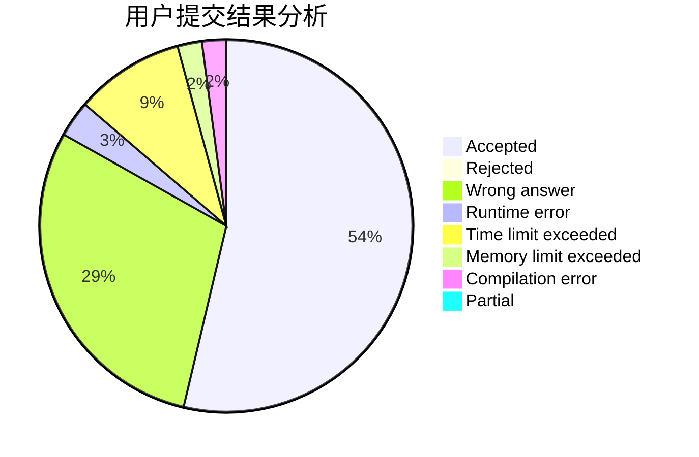
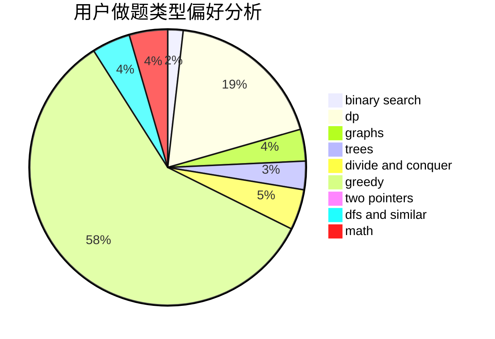

# zyb

<!-- tabs:start -->

#### **用户提交结果分析**

#### **用户做题类型偏好分析**

<!-- tabs:end -->
# 推荐题目
[1070D](https://codeforces.com/contest/1070/problem/D)
[546D](https://codeforces.com/contest/546/problem/D)
[722D](https://codeforces.com/contest/722/problem/D)
[1287B](https://codeforces.com/contest/1287/problem/B)
[449C](https://codeforces.com/contest/449/problem/C)
[96B](https://codeforces.com/contest/96/problem/B)
[1005D](https://codeforces.com/contest/1005/problem/D)
[1248E](https://codeforces.com/contest/1248/problem/E)
[1109F](https://codeforces.com/contest/1109/problem/F)
[356D](https://codeforces.com/contest/356/problem/D)
