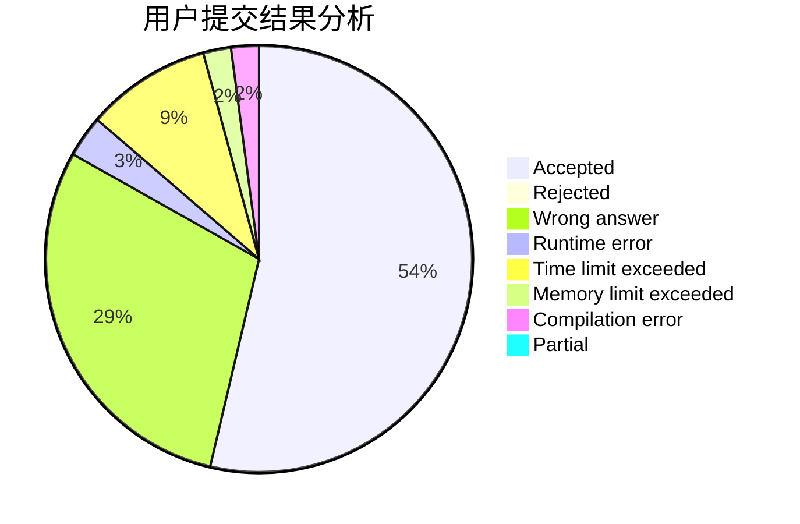
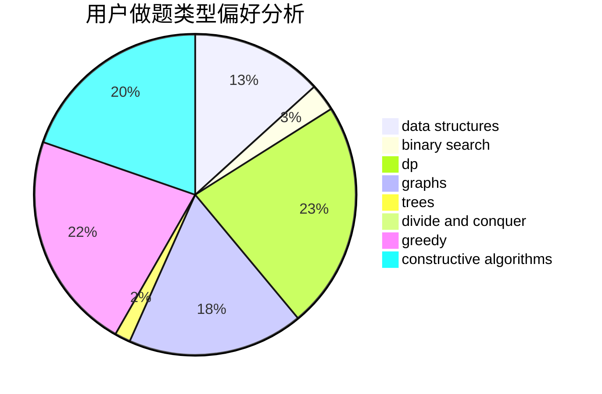
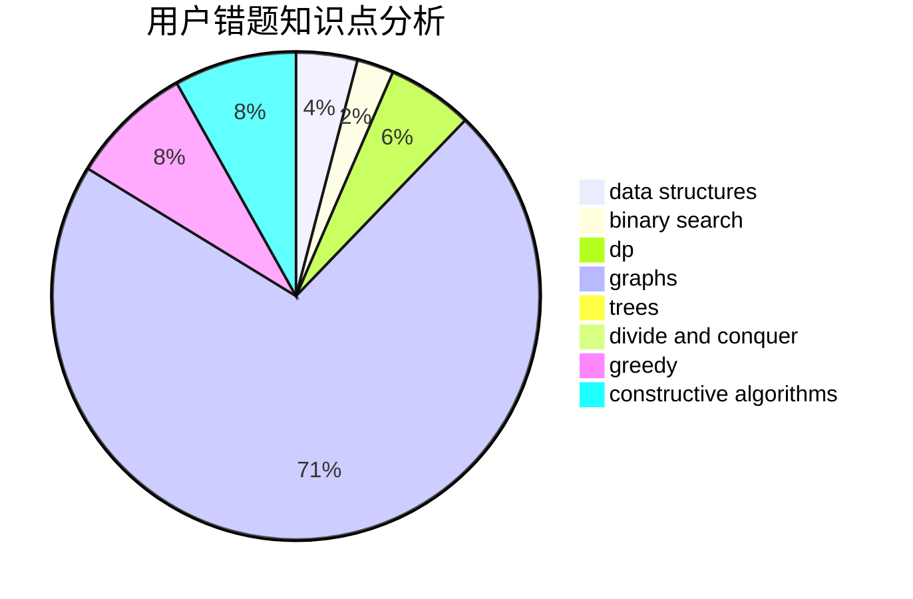

# zyb

<!-- tabs:start -->

#### **用户提交结果分析**

#### **用户做题类型偏好分析**

#### **用户错题知识点分析**

<!-- tabs:end -->
# 推荐题目
[1070A](https://codeforces.com/contest/1070/problem/A)		dp,
                        graphs,
                        number theory,
                        shortest paths		  
[520E](https://codeforces.com/contest/520/problem/E)		combinatorics,
                        dp,
                        math,
                        number theory		  
[703C](https://codeforces.com/contest/703/problem/C)		geometry,
                        implementation		  
[1281B](https://codeforces.com/contest/1281/problem/B)		greedy		  
[425E](https://codeforces.com/contest/425/problem/E)		dp		  
[952A](https://codeforces.com/contest/952/problem/A)		math		  
[1005C](https://codeforces.com/contest/1005/problem/C)		brute force,
                        greedy,
                        implementation		  
[1243D](https://codeforces.com/contest/1243/problem/D)		dsu,graphs,sortings,trees		  
[1109B](https://codeforces.com/contest/1109/problem/B)		constructive algorithms,
                        hashing,
                        strings		  
[328A](https://codeforces.com/contest/328/problem/A)		implementation		  
