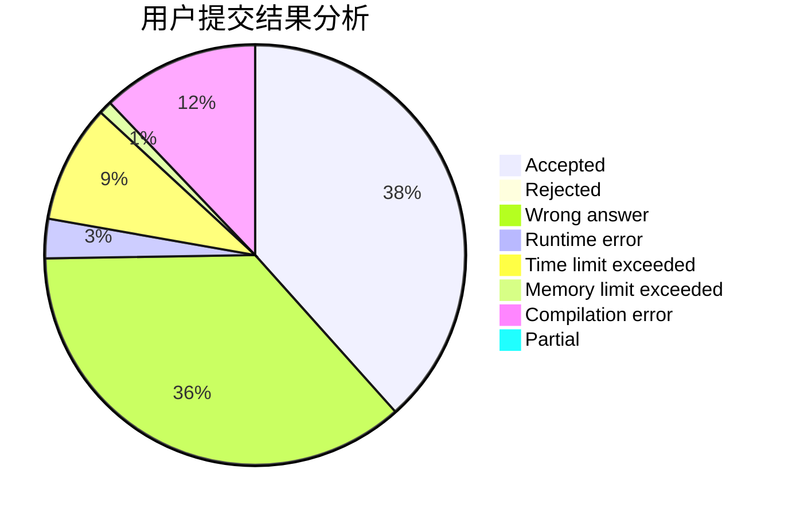
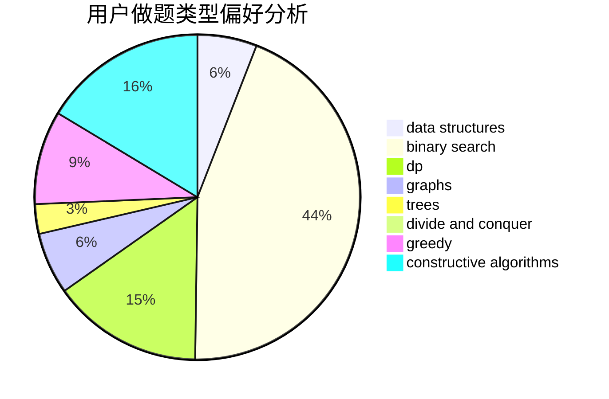
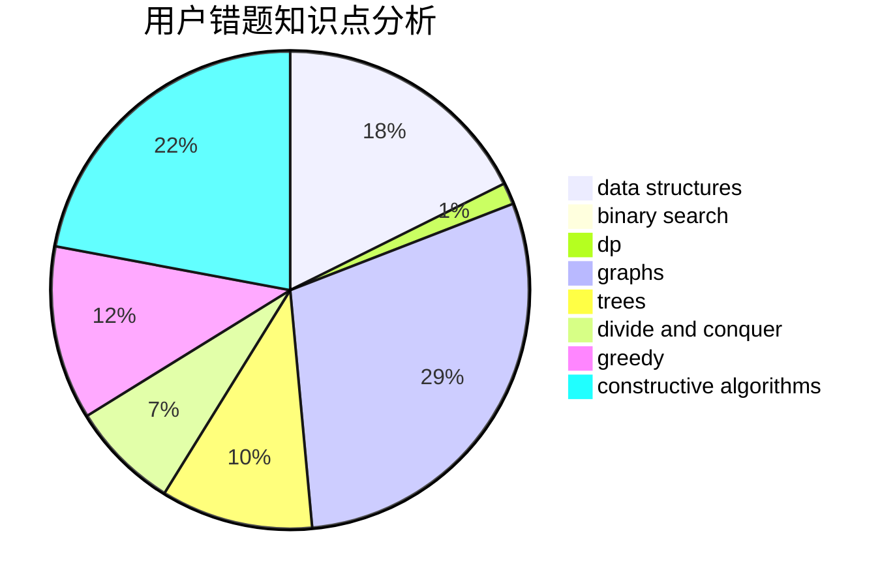

# zysbzddsj

<!-- tabs:start -->

#### **用户提交结果分析**

#### **用户做题类型偏好分析**

#### **用户错题知识点分析**

<!-- tabs:end -->
# 推荐题目
[1087B](https://codeforces.com/contest/1087/problem/B)		dsu,graphs,sortings,trees		  
[809C](https://codeforces.com/contest/809/problem/C)		combinatorics,
                        divide and conquer,
                        dp		  
[1340D](https://codeforces.com/contest/1340/problem/D)		constructive algorithms,
                        dfs and similar,
                        graphs,
                        trees		  
[429A](https://codeforces.com/contest/429/problem/A)		dfs and similar,
                        trees		  
[1210D](https://codeforces.com/contest/1210/problem/D)		graphs		  
[607E](https://codeforces.com/contest/607/problem/E)		binary search,
                        geometry		  
[139A](https://codeforces.com/contest/139/problem/A)		implementation		  
[1295D](https://codeforces.com/contest/1295/problem/D)		math,
                        number theory		  
[489F](https://codeforces.com/contest/489/problem/F)		combinatorics,
                        dp		  
[678B](https://codeforces.com/contest/678/problem/B)		implementation		  
