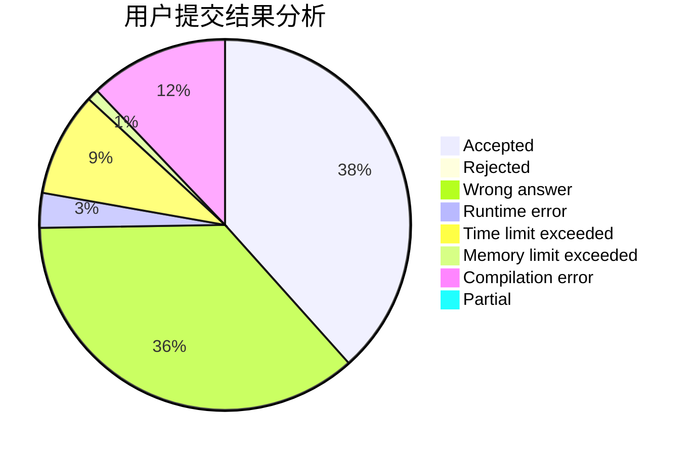
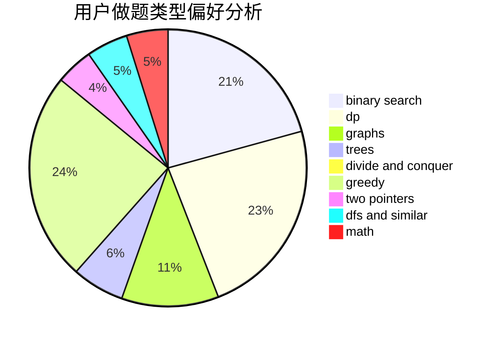

# zysbzddsj

<!-- tabs:start -->

#### **用户提交结果分析**

#### **用户做题类型偏好分析**

<!-- tabs:end -->
# 推荐题目
[1087B](https://codeforces.com/contest/1087/problem/B)
[809C](https://codeforces.com/contest/809/problem/C)
[1340D](https://codeforces.com/contest/1340/problem/D)
[429A](https://codeforces.com/contest/429/problem/A)
[1210D](https://codeforces.com/contest/1210/problem/D)
[607E](https://codeforces.com/contest/607/problem/E)
[139A](https://codeforces.com/contest/139/problem/A)
[1295D](https://codeforces.com/contest/1295/problem/D)
[489F](https://codeforces.com/contest/489/problem/F)
[678B](https://codeforces.com/contest/678/problem/B)
