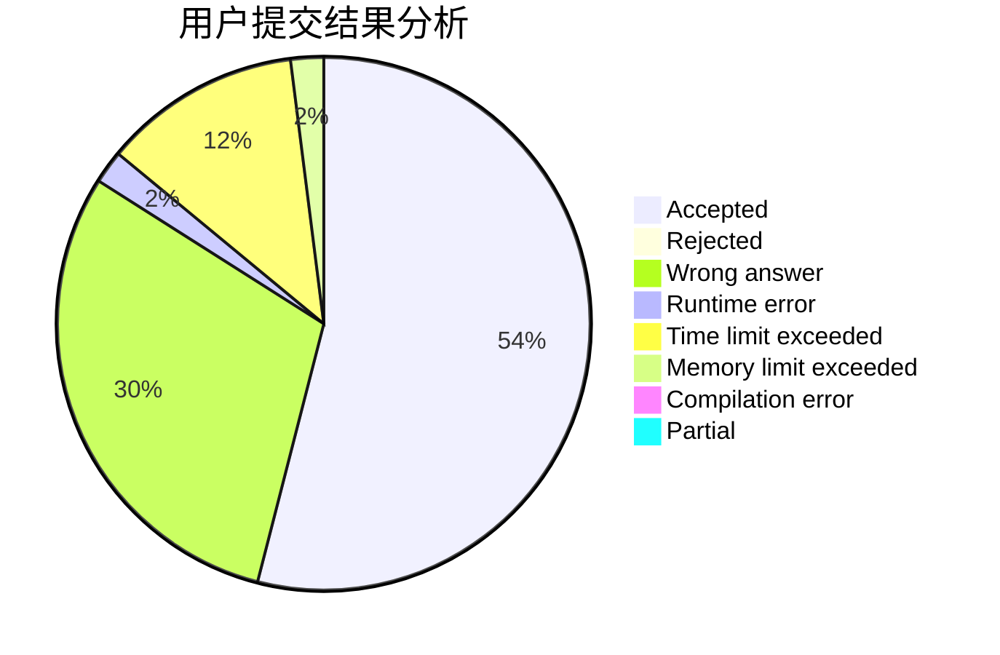
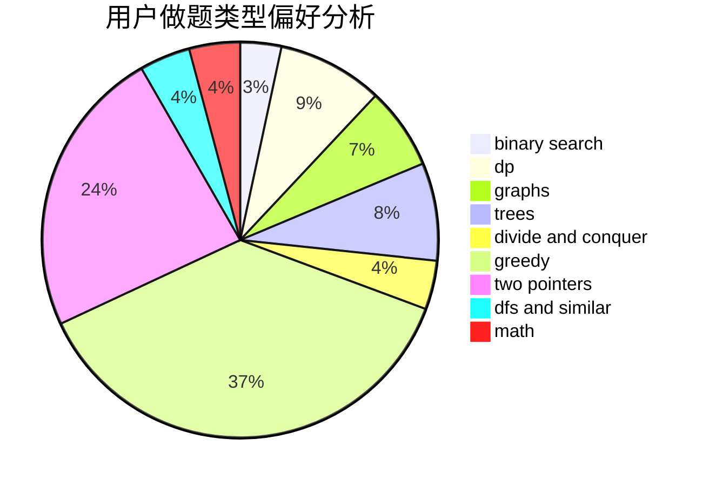

# zyz07

<!-- tabs:start -->

#### **用户提交结果分析**

#### **用户做题类型偏好分析**

<!-- tabs:end -->
# 推荐题目
[1228D](https://codeforces.com/contest/1228/problem/D)
[1349E](https://codeforces.com/contest/1349/problem/E)
[676D](https://codeforces.com/contest/676/problem/D)
[1316F](https://codeforces.com/contest/1316/problem/F)
[540C](https://codeforces.com/contest/540/problem/C)
[957E](https://codeforces.com/contest/957/problem/E)
[600C](https://codeforces.com/contest/600/problem/C)
[279D](https://codeforces.com/contest/279/problem/D)
[666A](https://codeforces.com/contest/666/problem/A)
[1149C](https://codeforces.com/contest/1149/problem/C)
