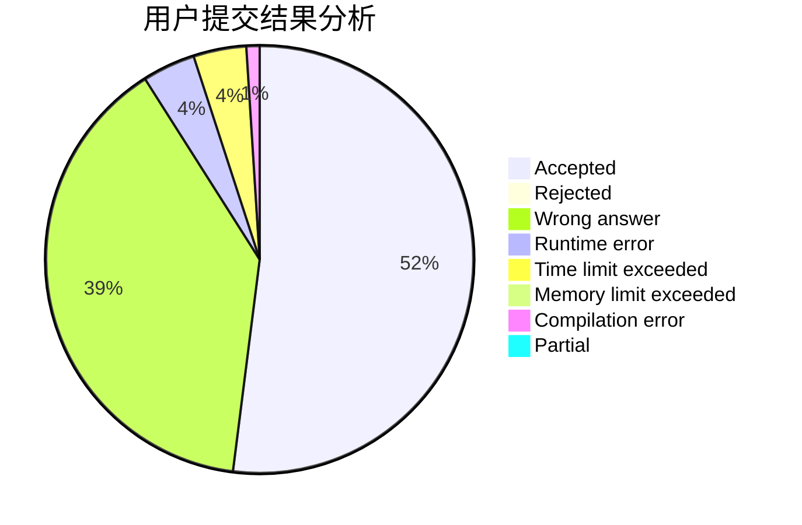
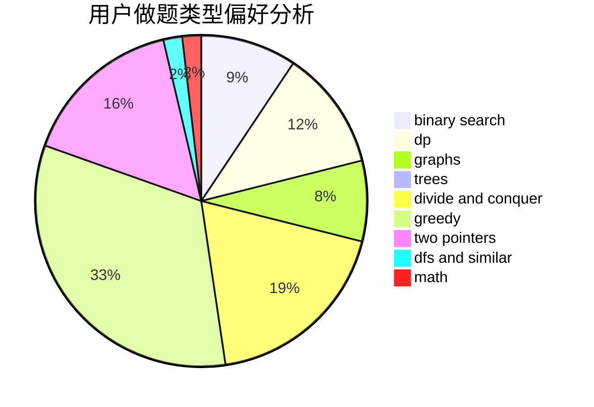

# zzctommy

<!-- tabs:start -->

#### **用户提交结果分析**

#### **用户做题类型偏好分析**

<!-- tabs:end -->
# 推荐题目
[13573](https://codeforces.com/contest/1357/problem/3)
[397E](https://codeforces.com/contest/397/problem/E)
[794C](https://codeforces.com/contest/794/problem/C)
[356E](https://codeforces.com/contest/356/problem/E)
[1213F](https://codeforces.com/contest/1213/problem/F)
[931A](https://codeforces.com/contest/931/problem/A)
[228E](https://codeforces.com/contest/228/problem/E)
[103B](https://codeforces.com/contest/103/problem/B)
[128C](https://codeforces.com/contest/128/problem/C)
[323B](https://codeforces.com/contest/323/problem/B)
