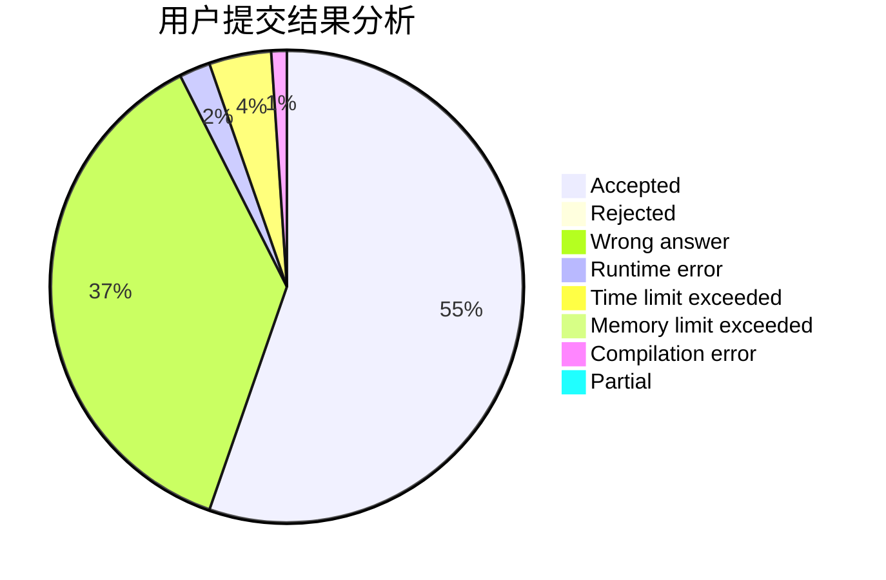
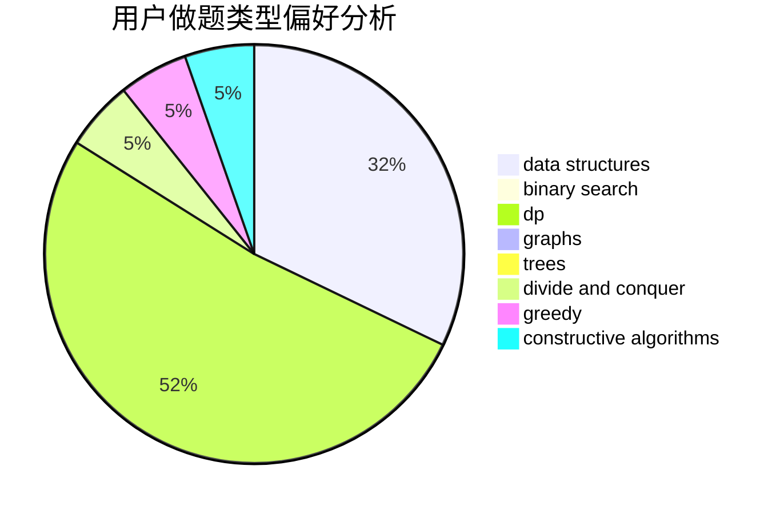
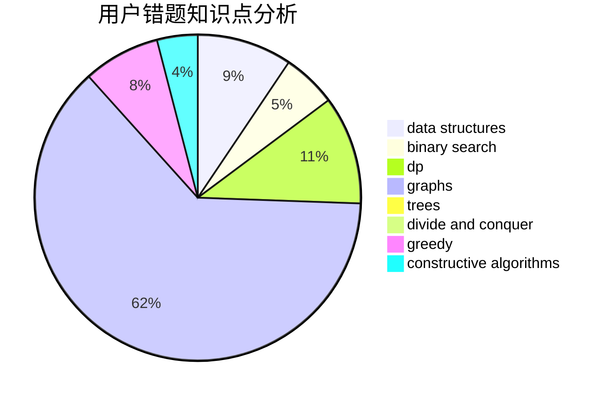

# zzlzzlzzl

<!-- tabs:start -->

#### **用户提交结果分析**

#### **用户做题类型偏好分析**

#### **用户错题知识点分析**

<!-- tabs:end -->
# 推荐题目
[936D](https://codeforces.com/contest/936/problem/D)		dp,
                        greedy		  
[998C](https://codeforces.com/contest/998/problem/C)		dsu,graphs,sortings,trees		  
[991B](https://codeforces.com/contest/991/problem/B)		greedy,
                        sortings		  
[1036E](https://codeforces.com/contest/1036/problem/E)		fft,
                        geometry,
                        number theory		  
[729E](https://codeforces.com/contest/729/problem/E)		constructive algorithms,
                        data structures,
                        graphs,
                        greedy,
                        sortings		  
[258A](https://codeforces.com/contest/258/problem/A)		greedy,
                        math		  
[1225G](https://codeforces.com/contest/1225/problem/G)		bitmasks,
                        constructive algorithms,
                        dp,
                        greedy,
                        number theory		  
[1250E](https://codeforces.com/contest/1250/problem/E)		graphs,
                        implementation		  
[1461D](https://codeforces.com/contest/1461/problem/D)		binary search,
                        brute force,
                        data structures,
                        divide and conquer,
                        implementation,
                        sortings		  
[1506D](https://codeforces.com/contest/1506/problem/D)		constructive algorithms,
                        data structures,
                        greedy		  
