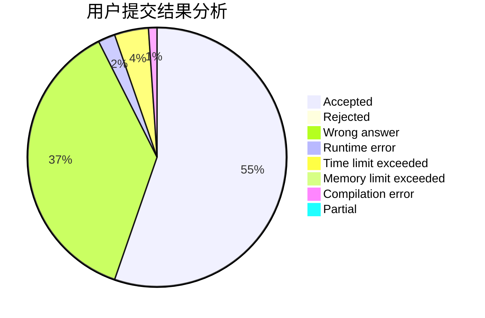
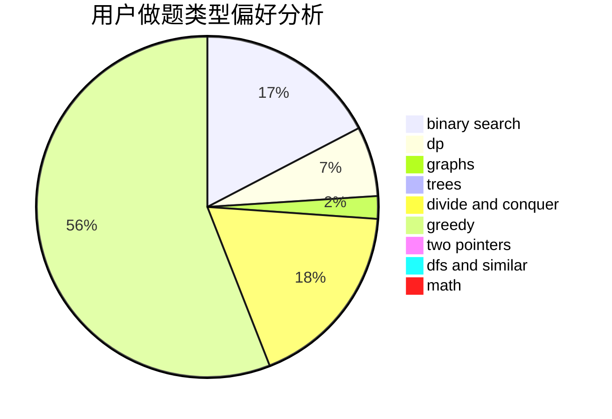

# zzlzzlzzl

<!-- tabs:start -->

#### **用户提交结果分析**

#### **用户做题类型偏好分析**

<!-- tabs:end -->
# 推荐题目
[936D](https://codeforces.com/contest/936/problem/D)
[998C](https://codeforces.com/contest/998/problem/C)
[991B](https://codeforces.com/contest/991/problem/B)
[1036E](https://codeforces.com/contest/1036/problem/E)
[729E](https://codeforces.com/contest/729/problem/E)
[258A](https://codeforces.com/contest/258/problem/A)
[1225G](https://codeforces.com/contest/1225/problem/G)
[1250E](https://codeforces.com/contest/1250/problem/E)
[1461D](https://codeforces.com/contest/1461/problem/D)
[1506D](https://codeforces.com/contest/1506/problem/D)
