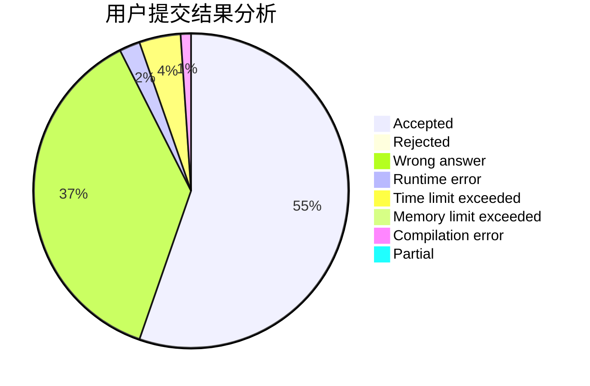
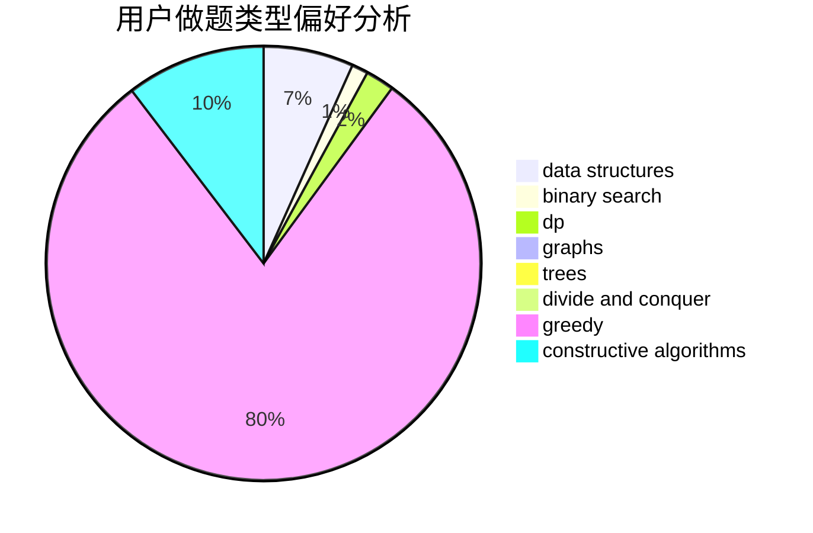
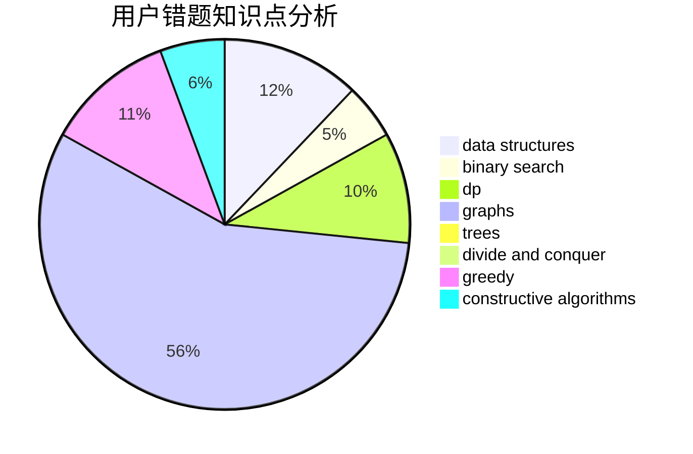

# zzlzzlzzl

<!-- tabs:start -->

#### **用户提交结果分析**

#### **用户做题类型偏好分析**

#### **用户错题知识点分析**

<!-- tabs:end -->
# 推荐题目
[916C](https://codeforces.com/contest/916/problem/C)		constructive algorithms,
                        graphs,
                        shortest paths		  
[982E](https://codeforces.com/contest/982/problem/E)		geometry,
                        number theory		  
[977D](https://codeforces.com/contest/977/problem/D)		dfs and similar,
                        math,
                        sortings		  
[1036B](https://codeforces.com/contest/1036/problem/B)		math		  
[709D](https://codeforces.com/contest/709/problem/D)		dsu,graphs,sortings,trees		  
[235B](https://codeforces.com/contest/235/problem/B)		dp,
                        math,
                        probabilities		  
[1218I](https://codeforces.com/contest/1218/problem/I)		2-sat,
                        dfs and similar,
                        greedy		  
[1245C](https://codeforces.com/contest/1245/problem/C)		dp		  
[1452A](https://codeforces.com/contest/1452/problem/A)		math		  
[1497E2](https://codeforces.com/contest/1497E/problem/2)		data structures,
                        dp,
                        greedy,
                        math,
                        number theory,
                        two pointers		  
