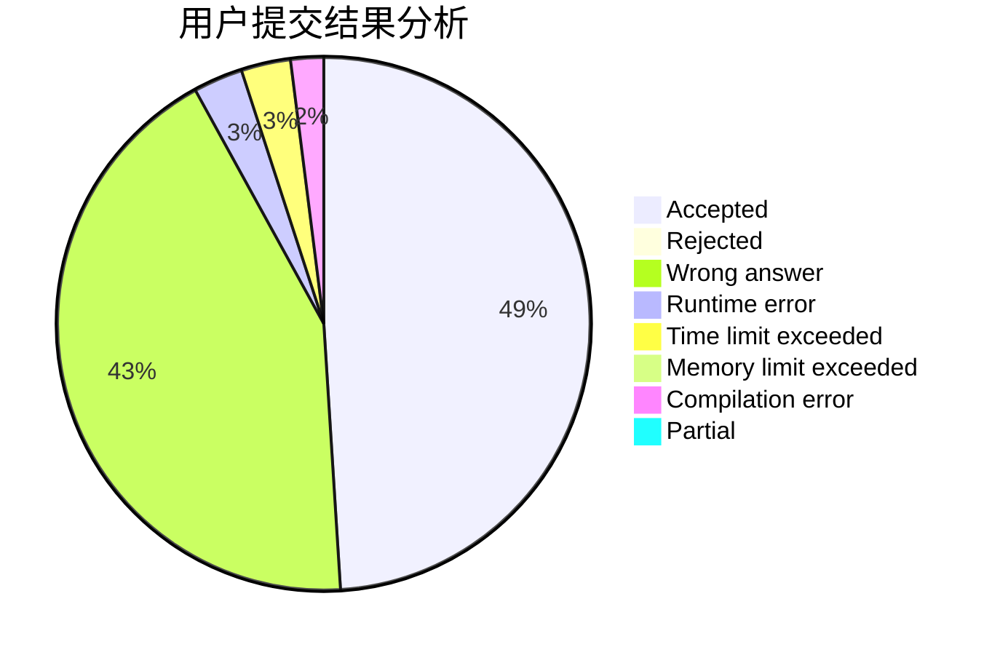
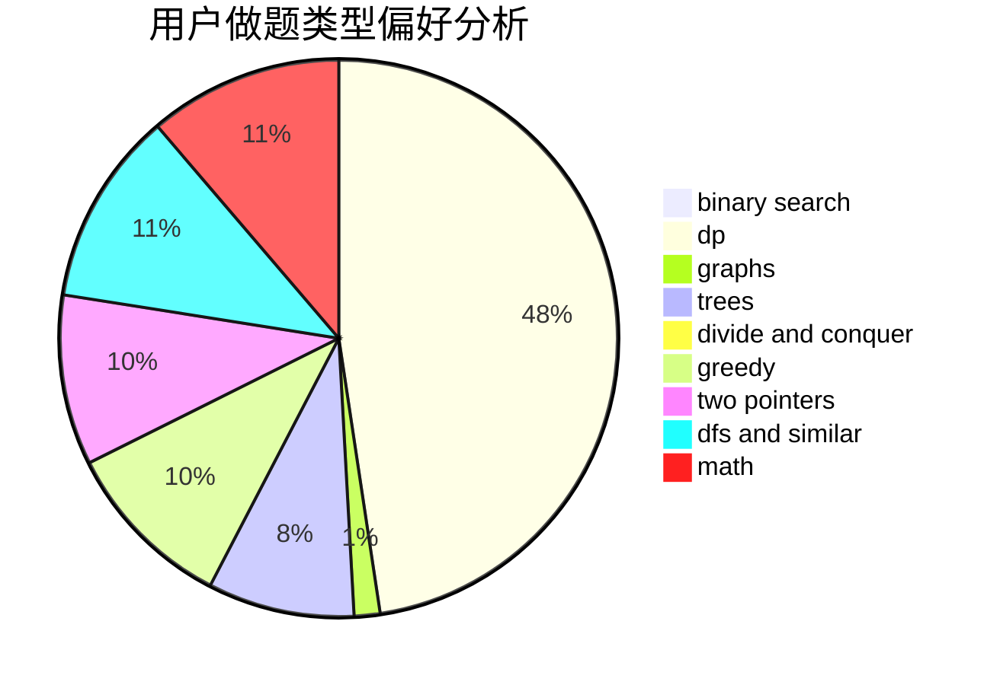

# zzm824

<!-- tabs:start -->

#### **用户提交结果分析**

#### **用户做题类型偏好分析**

<!-- tabs:end -->
# 推荐题目
[623E](https://codeforces.com/contest/623/problem/E)
[615D](https://codeforces.com/contest/615/problem/D)
[213C](https://codeforces.com/contest/213/problem/C)
[856C](https://codeforces.com/contest/856/problem/C)
[1131D](https://codeforces.com/contest/1131/problem/D)
[12131](https://codeforces.com/contest/1213/problem/1)
[462B](https://codeforces.com/contest/462/problem/B)
[1101D](https://codeforces.com/contest/1101/problem/D)
[903A](https://codeforces.com/contest/903/problem/A)
[286B](https://codeforces.com/contest/286/problem/B)
