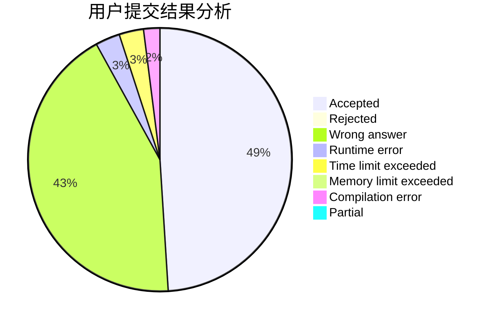
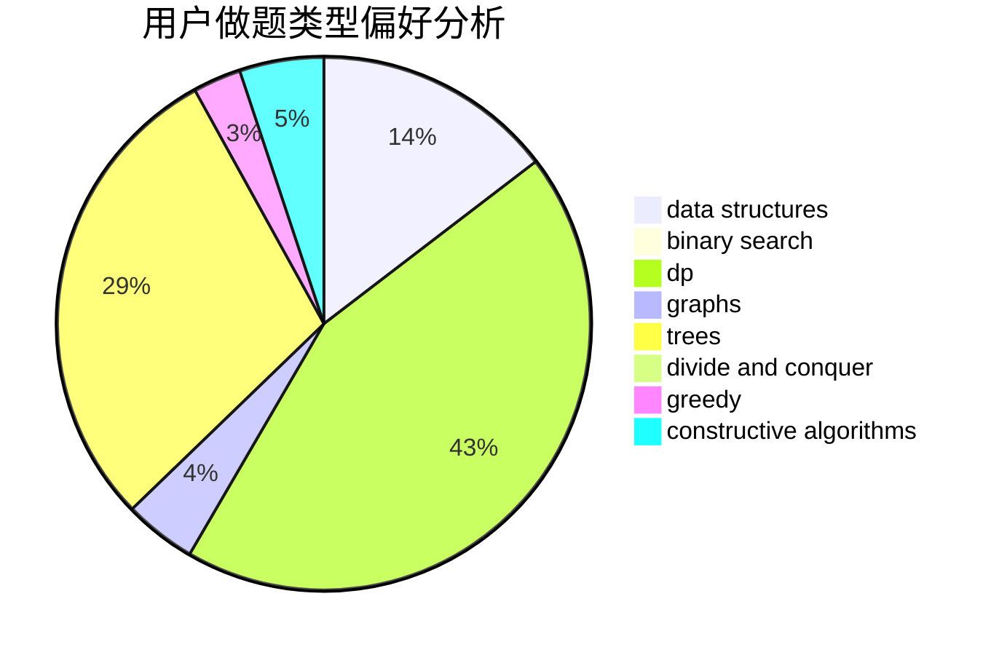

# zzm824

<!-- tabs:start -->

#### **用户提交结果分析**

#### **用户做题类型偏好分析**

#### **用户错题知识点分析**

<!-- tabs:end -->
# 推荐题目
[623E](https://codeforces.com/contest/623/problem/E)		combinatorics,
                        dp,
                        fft,
                        math		  
[615D](https://codeforces.com/contest/615/problem/D)		math,
                        number theory		  
[213C](https://codeforces.com/contest/213/problem/C)		dp		  
[856C](https://codeforces.com/contest/856/problem/C)		combinatorics,
                        dp,
                        math		  
[1131D](https://codeforces.com/contest/1131/problem/D)		dfs and similar,
                        dp,
                        dsu,
                        graphs,
                        greedy		  
[12131](https://codeforces.com/contest/1213/problem/1)		dsu,graphs,sortings,trees		  
[462B](https://codeforces.com/contest/462/problem/B)		greedy		  
[1101D](https://codeforces.com/contest/1101/problem/D)		data structures,
                        dfs and similar,
                        dp,
                        number theory,
                        trees		  
[903A](https://codeforces.com/contest/903/problem/A)		greedy,
                        implementation		  
[286B](https://codeforces.com/contest/286/problem/B)		implementation		  
