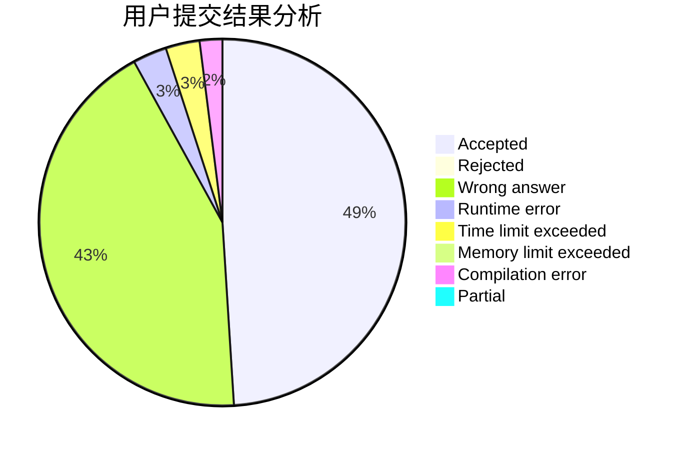
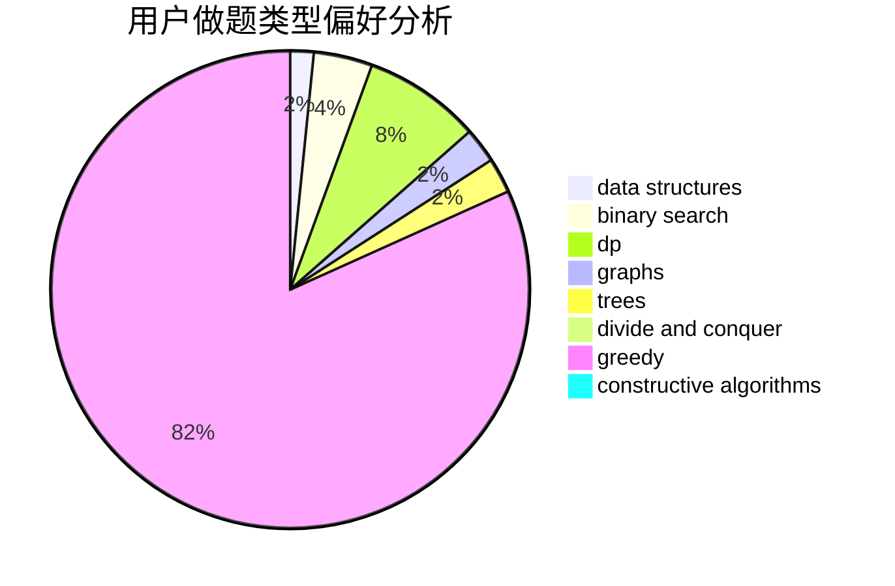

# zzm824

<!-- tabs:start -->

#### **用户提交结果分析**

#### **用户做题类型偏好分析**

#### **用户错题知识点分析**

<!-- tabs:end -->
# 推荐题目
[605E](https://codeforces.com/contest/605/problem/E)		probabilities,
                        shortest paths		  
[598A](https://codeforces.com/contest/598/problem/A)		math		  
[189B](https://codeforces.com/contest/189/problem/B)		brute force,
                        math		  
[838C](https://codeforces.com/contest/838/problem/C)		dp,
                        games		  
[1129D](https://codeforces.com/contest/1129/problem/D)		data structures,
                        dp		  
[1207C](https://codeforces.com/contest/1207/problem/C)		dp,
                        greedy		  
[441D](https://codeforces.com/contest/441/problem/D)		constructive algorithms,
                        dsu,
                        graphs,
                        implementation,
                        math,
                        string suffix structures		  
[1101A](https://codeforces.com/contest/1101/problem/A)		math		  
[884D](https://codeforces.com/contest/884/problem/D)		data structures,
                        greedy		  
[26A](https://codeforces.com/contest/26/problem/A)		number theory		  
