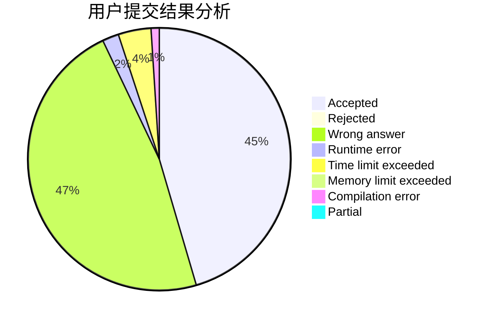
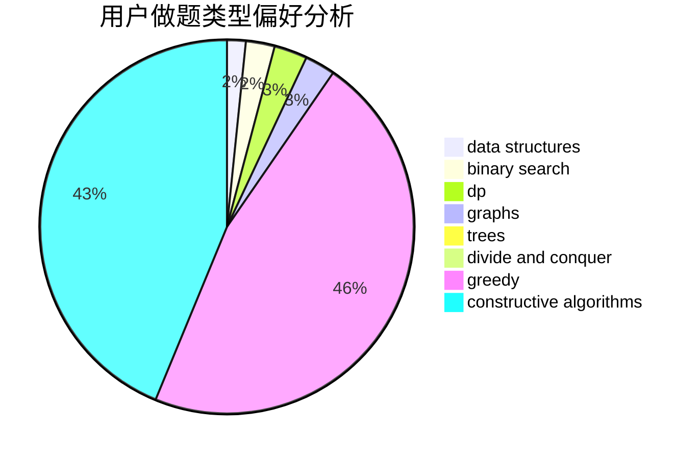
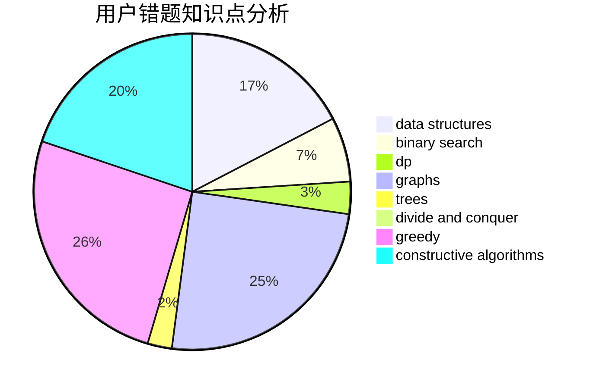

# zzn_nzz

<!-- tabs:start -->

#### **用户提交结果分析**

#### **用户做题类型偏好分析**

#### **用户错题知识点分析**

<!-- tabs:end -->
# 推荐题目
[659F](https://codeforces.com/contest/659/problem/F)		dfs and similar,
                        dsu,
                        graphs,
                        greedy,
                        sortings		  
[977A](https://codeforces.com/contest/977/problem/A)		implementation		  
[1077F2](https://codeforces.com/contest/1077F/problem/2)		data structures,
                        dp		  
[271A](https://codeforces.com/contest/271/problem/A)		brute force		  
[1076C](https://codeforces.com/contest/1076/problem/C)		binary search,
                        math		  
[706C](https://codeforces.com/contest/706/problem/C)		dp,
                        strings		  
[1034D](https://codeforces.com/contest/1034/problem/D)		binary search,
                        data structures,
                        two pointers		  
[516B](https://codeforces.com/contest/516/problem/B)		dsu,graphs,sortings,trees		  
[1237C1](https://codeforces.com/contest/1237C/problem/1)		constructive algorithms,
                        geometry,
                        greedy		  
[1506C](https://codeforces.com/contest/1506/problem/C)		brute force,
                        implementation,
                        strings		  
