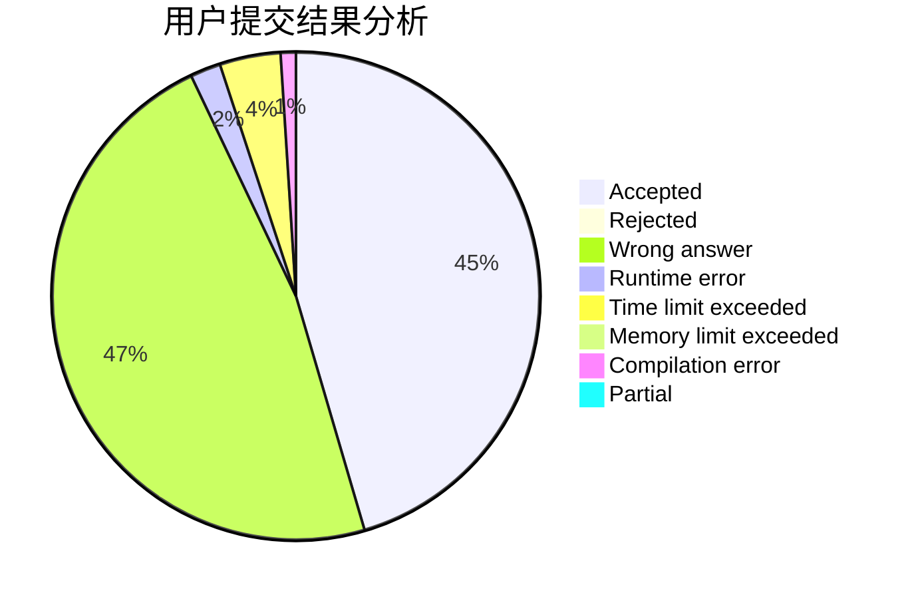
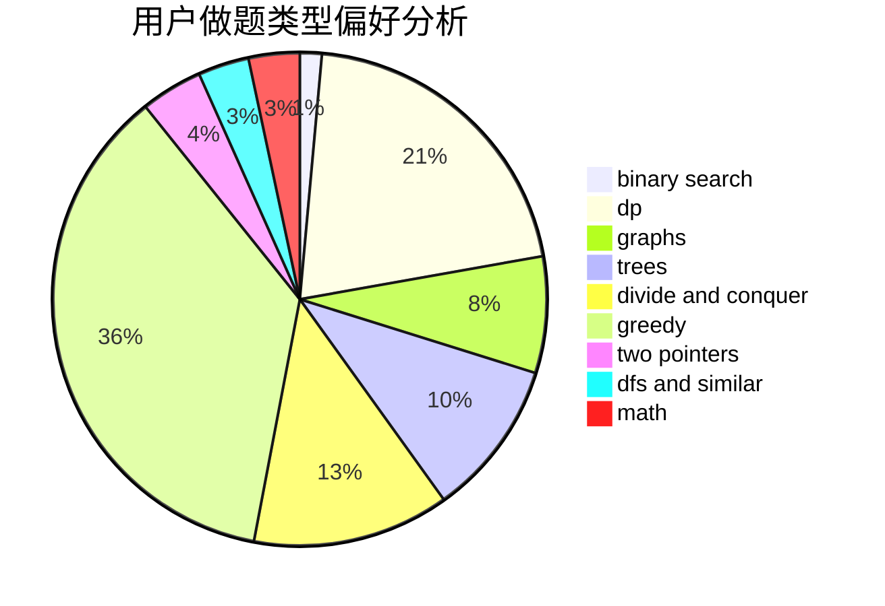

# zzn_nzz

<!-- tabs:start -->

#### **用户提交结果分析**

#### **用户做题类型偏好分析**

<!-- tabs:end -->
# 推荐题目
[67A](https://codeforces.com/contest/67/problem/A)
[990F](https://codeforces.com/contest/990/problem/F)
[1078C](https://codeforces.com/contest/1078/problem/C)
[287C](https://codeforces.com/contest/287/problem/C)
[1076F](https://codeforces.com/contest/1076/problem/F)
[724G](https://codeforces.com/contest/724/problem/G)
[1036B](https://codeforces.com/contest/1036/problem/B)
[543B](https://codeforces.com/contest/543/problem/B)
[1241E](https://codeforces.com/contest/1241/problem/E)
[157D](https://codeforces.com/contest/157/problem/D)
