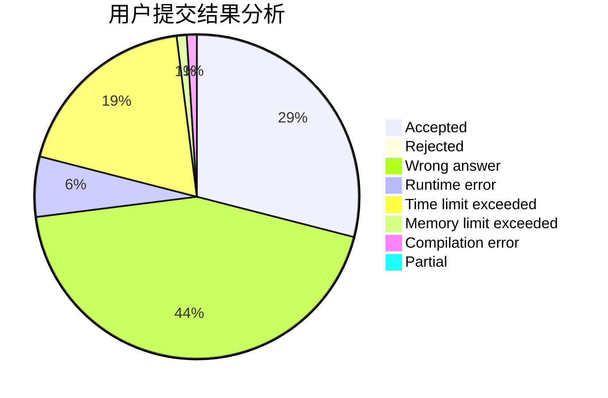
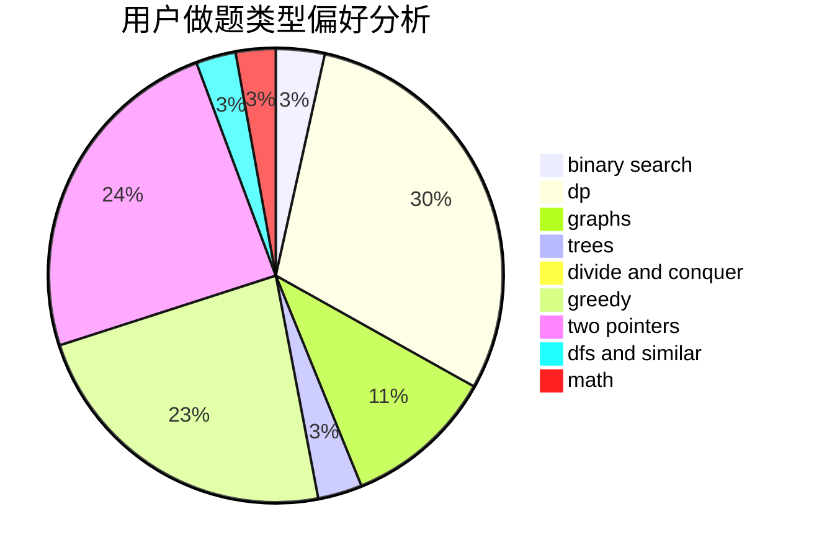

# zzq233

<!-- tabs:start -->

#### **用户提交结果分析**

#### **用户做题类型偏好分析**

<!-- tabs:end -->
# 推荐题目
[1059E](https://codeforces.com/contest/1059/problem/E)
[112A](https://codeforces.com/contest/112/problem/A)
[1077C](https://codeforces.com/contest/1077/problem/C)
[380E](https://codeforces.com/contest/380/problem/E)
[727A](https://codeforces.com/contest/727/problem/A)
[986A](https://codeforces.com/contest/986/problem/A)
[592C](https://codeforces.com/contest/592/problem/C)
[199D](https://codeforces.com/contest/199/problem/D)
[114B](https://codeforces.com/contest/114/problem/B)
[651C](https://codeforces.com/contest/651/problem/C)
