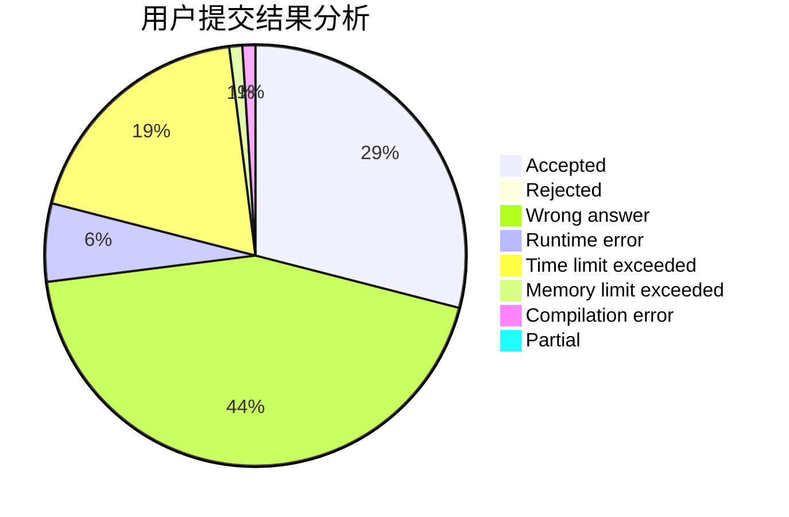
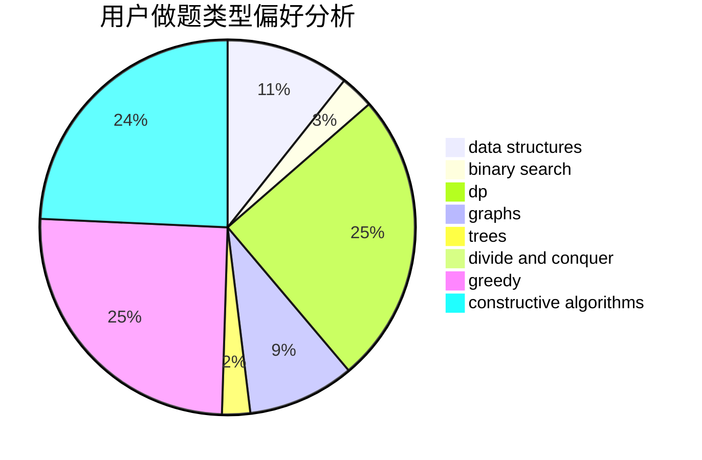
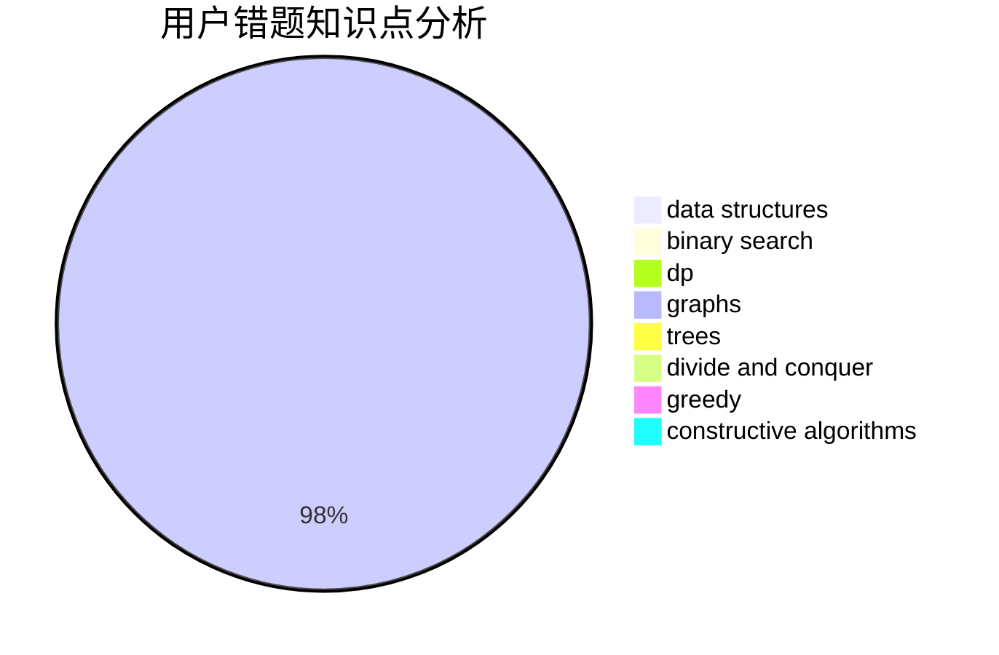

# zzq233

<!-- tabs:start -->

#### **用户提交结果分析**

#### **用户做题类型偏好分析**

#### **用户错题知识点分析**

<!-- tabs:end -->
# 推荐题目
[1059E](https://codeforces.com/contest/1059/problem/E)		binary search,
                        data structures,
                        dp,
                        greedy,
                        trees		  
[112A](https://codeforces.com/contest/112/problem/A)		implementation,
                        strings		  
[1077C](https://codeforces.com/contest/1077/problem/C)		nan		  
[380E](https://codeforces.com/contest/380/problem/E)		data structures		  
[727A](https://codeforces.com/contest/727/problem/A)		brute force,
                        dfs and similar,
                        math		  
[986A](https://codeforces.com/contest/986/problem/A)		graphs,
                        greedy,
                        number theory,
                        shortest paths		  
[592C](https://codeforces.com/contest/592/problem/C)		math		  
[199D](https://codeforces.com/contest/199/problem/D)		dsu,graphs,sortings,trees		  
[114B](https://codeforces.com/contest/114/problem/B)		bitmasks,
                        brute force,
                        graphs		  
[651C](https://codeforces.com/contest/651/problem/C)		dsu,graphs,sortings,trees		  
