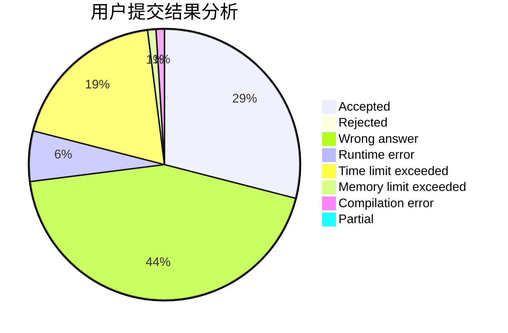
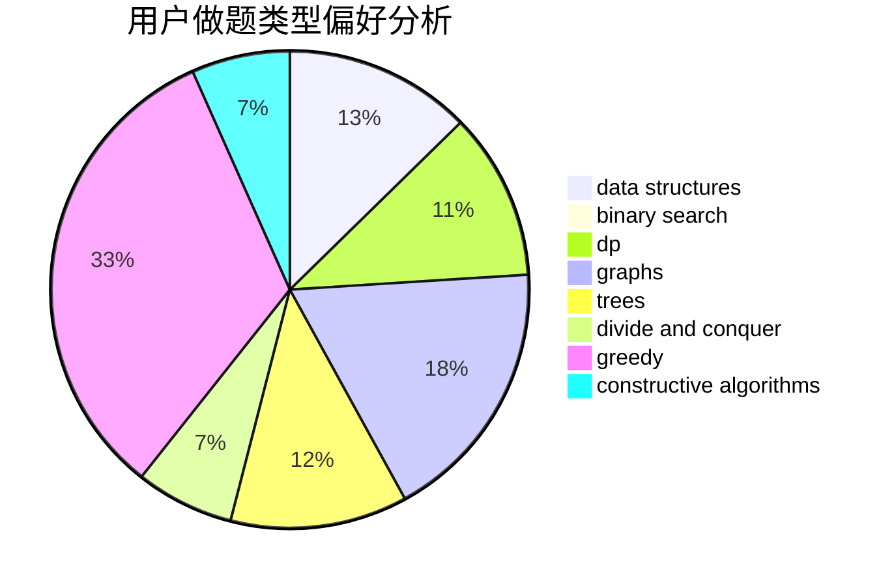
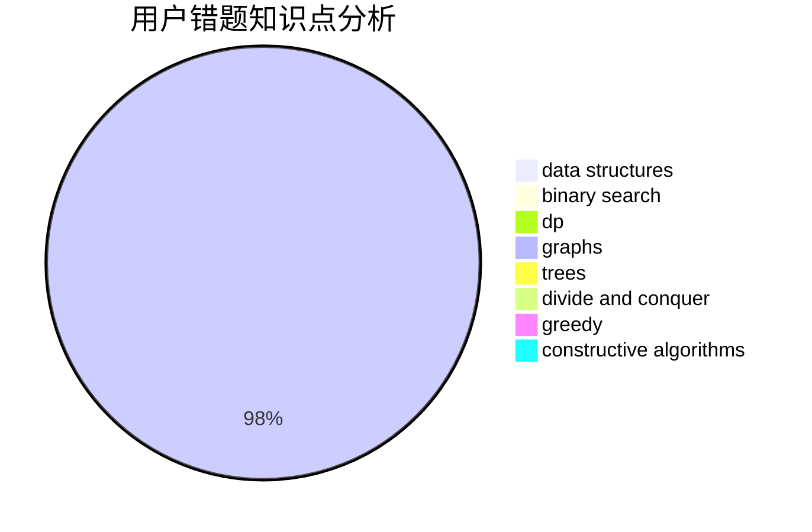

# zzq233

<!-- tabs:start -->

#### **用户提交结果分析**

#### **用户做题类型偏好分析**

#### **用户错题知识点分析**

<!-- tabs:end -->
# 推荐题目
[1059B](https://codeforces.com/contest/1059/problem/B)		implementation		  
[1120B](https://codeforces.com/contest/1120/problem/B)		constructive algorithms,
                        greedy,
                        implementation,
                        math		  
[1077B](https://codeforces.com/contest/1077/problem/B)		greedy		  
[356A](https://codeforces.com/contest/356/problem/A)		data structures,
                        dsu		  
[708A](https://codeforces.com/contest/708/problem/A)		constructive algorithms,
                        greedy,
                        implementation,
                        strings		  
[963C](https://codeforces.com/contest/963/problem/C)		brute force,
                        math,
                        number theory		  
[572A](https://codeforces.com/contest/572/problem/A)		sortings		  
[171F](https://codeforces.com/contest/171/problem/F)		*special problem,
                        brute force,
                        implementation,
                        number theory		  
[1148B](https://codeforces.com/contest/1148/problem/B)		binary search,
                        brute force,
                        two pointers		  
[623C](https://codeforces.com/contest/623/problem/C)		binary search,
                        dp		  
