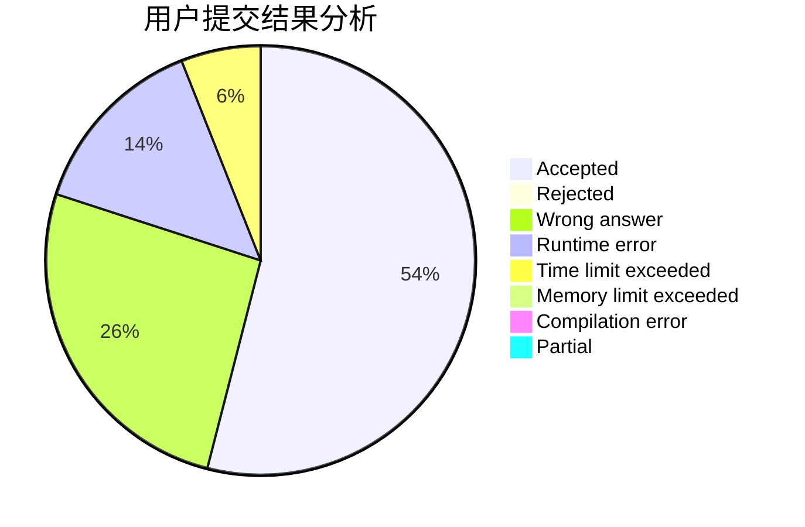
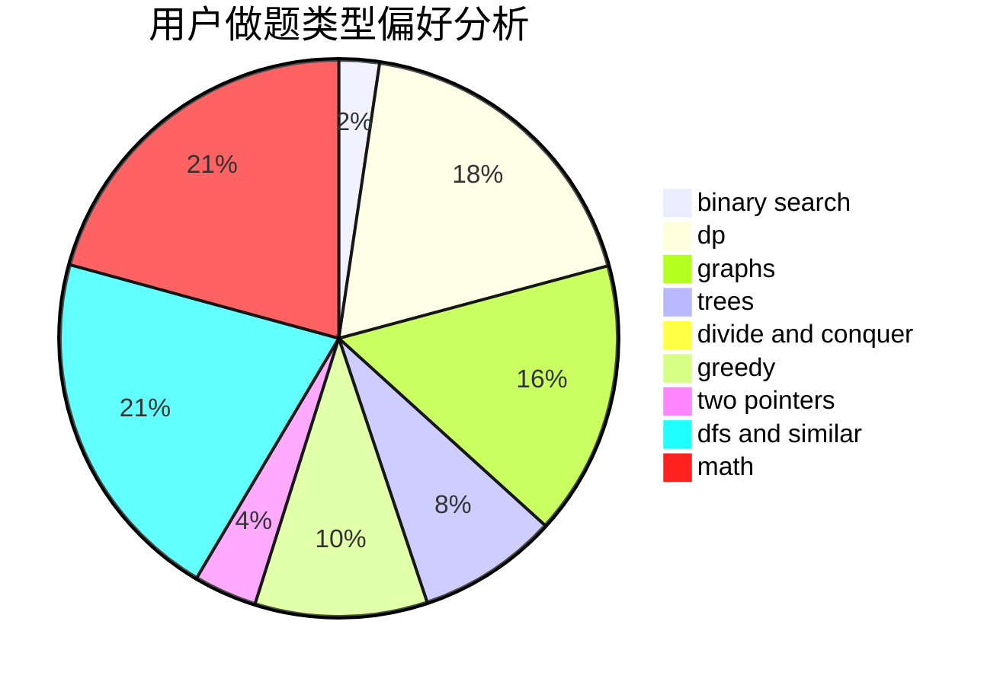

# zzq236

<!-- tabs:start -->

#### **用户提交结果分析**

#### **用户做题类型偏好分析**

<!-- tabs:end -->
# 推荐题目
[1186D](https://codeforces.com/contest/1186/problem/D)
[975E](https://codeforces.com/contest/975/problem/E)
[1091H](https://codeforces.com/contest/1091/problem/H)
[863F](https://codeforces.com/contest/863/problem/F)
[786A](https://codeforces.com/contest/786/problem/A)
[1316F](https://codeforces.com/contest/1316/problem/F)
[164C](https://codeforces.com/contest/164/problem/C)
[102B](https://codeforces.com/contest/102/problem/B)
[894D](https://codeforces.com/contest/894/problem/D)
[388C](https://codeforces.com/contest/388/problem/C)
