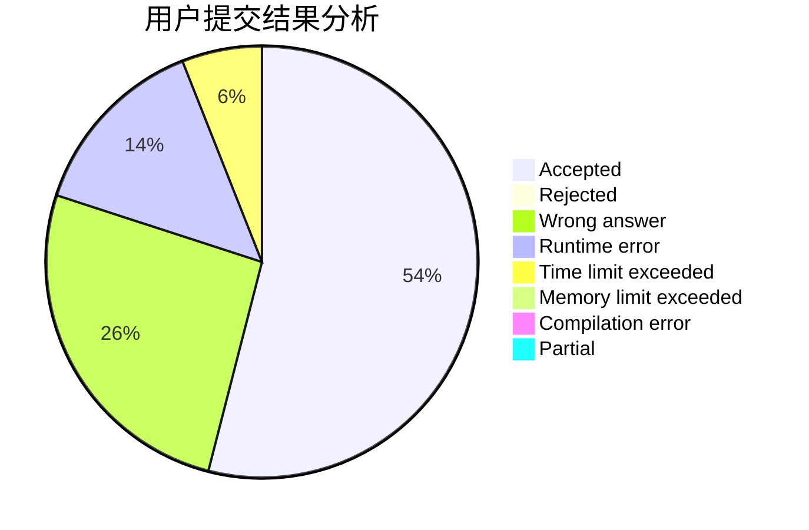
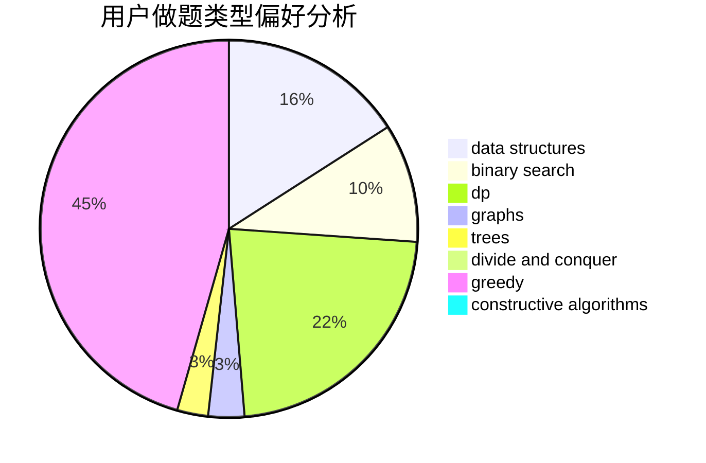

# zzq236

<!-- tabs:start -->

#### **用户提交结果分析**

#### **用户做题类型偏好分析**

#### **用户错题知识点分析**

<!-- tabs:end -->
# 推荐题目
[1186D](https://codeforces.com/contest/1186/problem/D)		constructive algorithms,
                        greedy,
                        math		  
[975E](https://codeforces.com/contest/975/problem/E)		geometry		  
[1091H](https://codeforces.com/contest/1091/problem/H)		games		  
[863F](https://codeforces.com/contest/863/problem/F)		flows		  
[786A](https://codeforces.com/contest/786/problem/A)		dfs and similar,
                        dp,
                        games		  
[1316F](https://codeforces.com/contest/1316/problem/F)		data structures,
                        divide and conquer,
                        probabilities		  
[164C](https://codeforces.com/contest/164/problem/C)		flows,
                        graphs		  
[102B](https://codeforces.com/contest/102/problem/B)		implementation		  
[894D](https://codeforces.com/contest/894/problem/D)		brute force,
                        data structures,
                        trees		  
[388C](https://codeforces.com/contest/388/problem/C)		games,
                        greedy,
                        sortings		  
