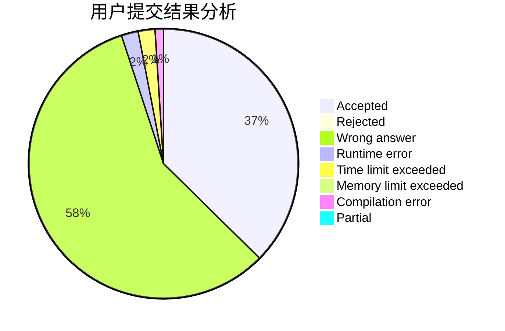
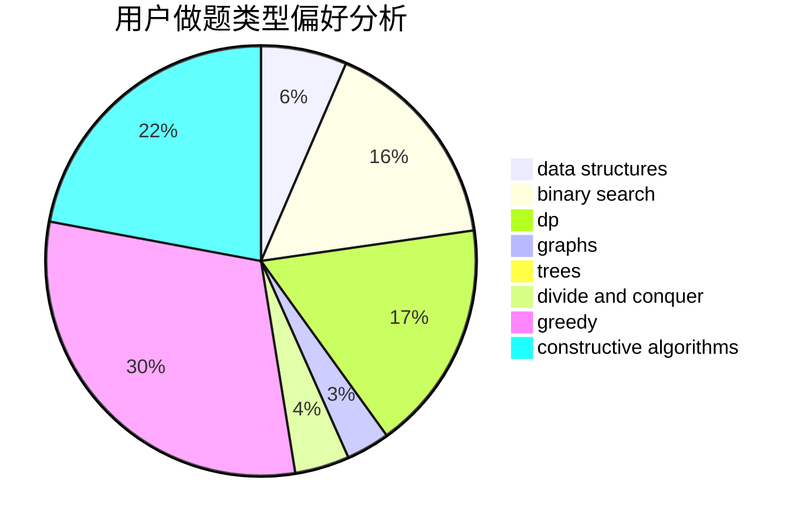

# zzqwtc

<!-- tabs:start -->

#### **用户提交结果分析**

#### **用户做题类型偏好分析**

#### **用户错题知识点分析**

<!-- tabs:end -->
# 推荐题目
[750A](https://codeforces.com/contest/750/problem/A)		binary search,
                        brute force,
                        implementation,
                        math		  
[789B](https://codeforces.com/contest/789/problem/B)		brute force,
                        implementation,
                        math		  
[238C](https://codeforces.com/contest/238/problem/C)		dfs and similar,
                        dp,
                        greedy,
                        trees		  
[1371C](https://codeforces.com/contest/1371/problem/C)		greedy,
                        implementation,
                        math		  
[1398A](https://codeforces.com/contest/1398/problem/A)		geometry,
                        math		  
[118B](https://codeforces.com/contest/118/problem/B)		constructive algorithms,
                        implementation		  
[1198B](https://codeforces.com/contest/1198/problem/B)		binary search,
                        brute force,
                        data structures,
                        sortings		  
[630F](https://codeforces.com/contest/630/problem/F)		combinatorics,
                        math		  
[1101C](https://codeforces.com/contest/1101/problem/C)		sortings		  
[1141F2](https://codeforces.com/contest/1141F/problem/2)		data structures,
                        greedy		  
