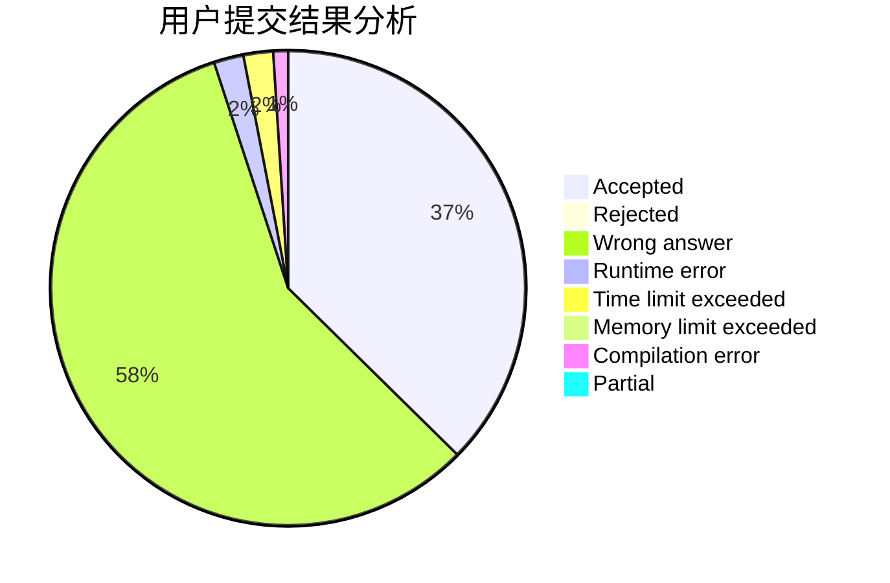
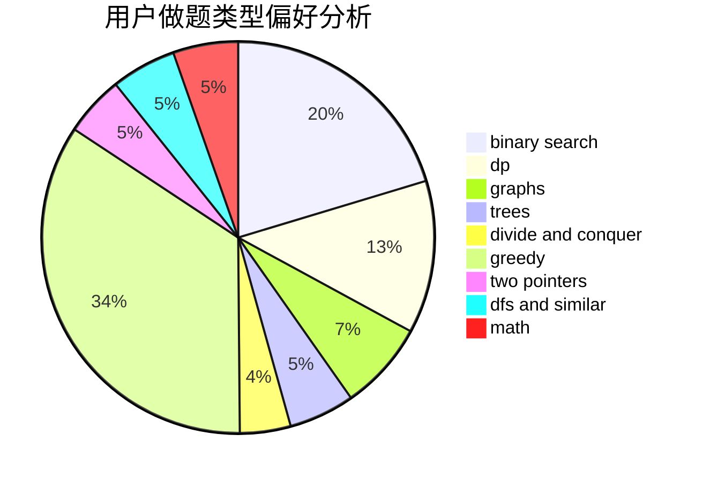

# zzqwtc

<!-- tabs:start -->

#### **用户提交结果分析**

#### **用户做题类型偏好分析**

<!-- tabs:end -->
# 推荐题目
[76A](https://codeforces.com/contest/76/problem/A)
[804D](https://codeforces.com/contest/804/problem/D)
[25E](https://codeforces.com/contest/25/problem/E)
[1380A](https://codeforces.com/contest/1380/problem/A)
[1406E](https://codeforces.com/contest/1406/problem/E)
[1195B](https://codeforces.com/contest/1195/problem/B)
[1201D](https://codeforces.com/contest/1201/problem/D)
[660B](https://codeforces.com/contest/660/problem/B)
[1101F](https://codeforces.com/contest/1101/problem/F)
[1144A](https://codeforces.com/contest/1144/problem/A)
