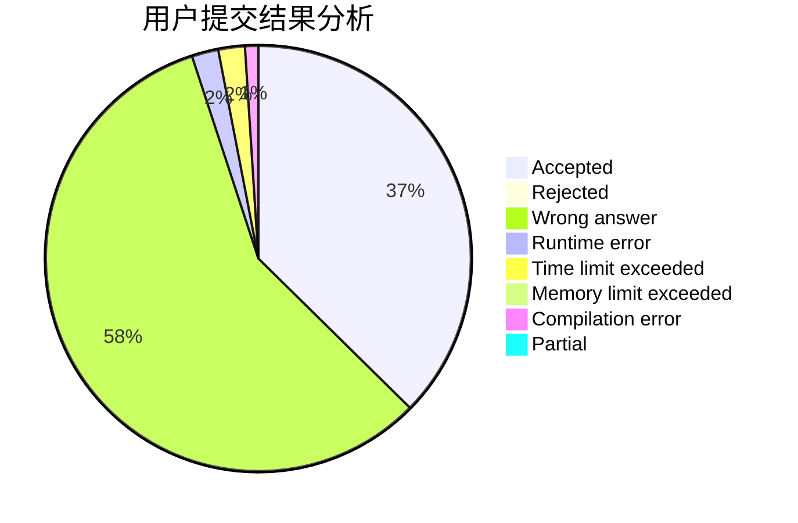
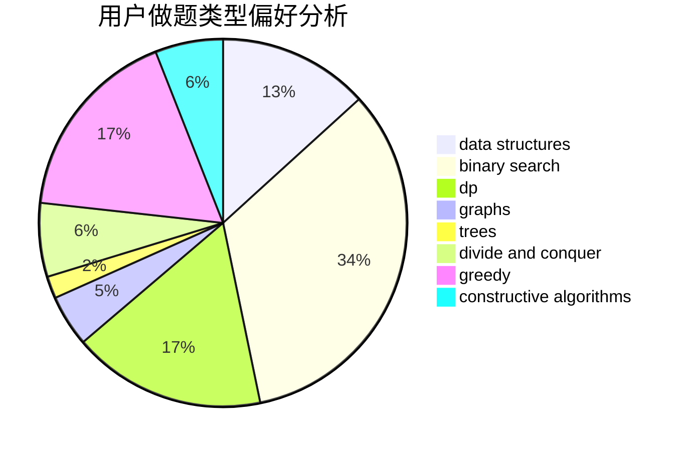

# zzqwtc

<!-- tabs:start -->

#### **用户提交结果分析**

#### **用户做题类型偏好分析**

#### **用户错题知识点分析**

<!-- tabs:end -->
# 推荐题目
[76A](https://codeforces.com/contest/76/problem/A)		dsu,
                        graphs,
                        sortings,
                        trees		  
[804D](https://codeforces.com/contest/804/problem/D)		binary search,
                        brute force,
                        dfs and similar,
                        dp,
                        sortings,
                        trees		  
[25E](https://codeforces.com/contest/25/problem/E)		hashing,
                        strings		  
[1380A](https://codeforces.com/contest/1380/problem/A)		brute force,
                        data structures		  
[1406E](https://codeforces.com/contest/1406/problem/E)		interactive,
                        math,
                        number theory		  
[1195B](https://codeforces.com/contest/1195/problem/B)		binary search,
                        brute force,
                        math		  
[1201D](https://codeforces.com/contest/1201/problem/D)		binary search,
                        dp,
                        greedy,
                        implementation		  
[660B](https://codeforces.com/contest/660/problem/B)		implementation		  
[1101F](https://codeforces.com/contest/1101/problem/F)		binary search,
                        dp		  
[1144A](https://codeforces.com/contest/1144/problem/A)		implementation,
                        strings		  
