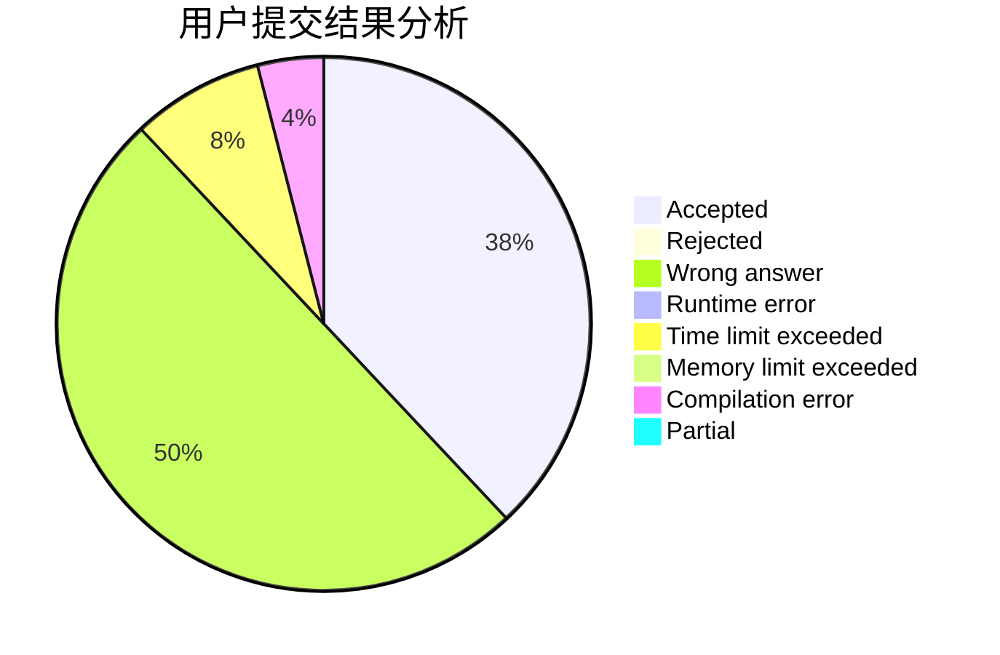
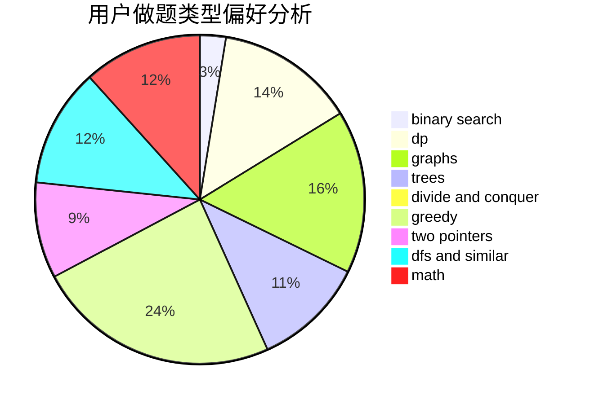

# Chiaro

<!-- tabs:start -->

#### **用户提交结果分析**

#### **用户做题类型偏好分析**

<!-- tabs:end -->
# 推荐题目
[16C](https://codeforces.com/contest/16/problem/C)
[1041C](https://codeforces.com/contest/1041/problem/C)
[1147E](https://codeforces.com/contest/1147/problem/E)
[484A](https://codeforces.com/contest/484/problem/A)
[1169C](https://codeforces.com/contest/1169/problem/C)
[321D](https://codeforces.com/contest/321/problem/D)
[1064B](https://codeforces.com/contest/1064/problem/B)
[360A](https://codeforces.com/contest/360/problem/A)
[483D](https://codeforces.com/contest/483/problem/D)
[1288B](https://codeforces.com/contest/1288/problem/B)
