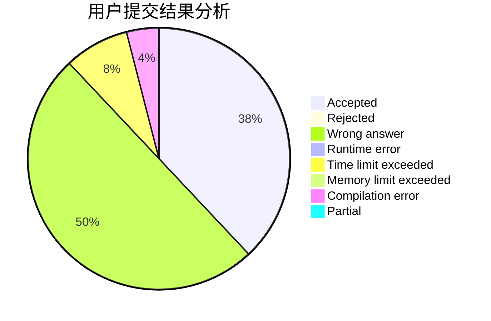
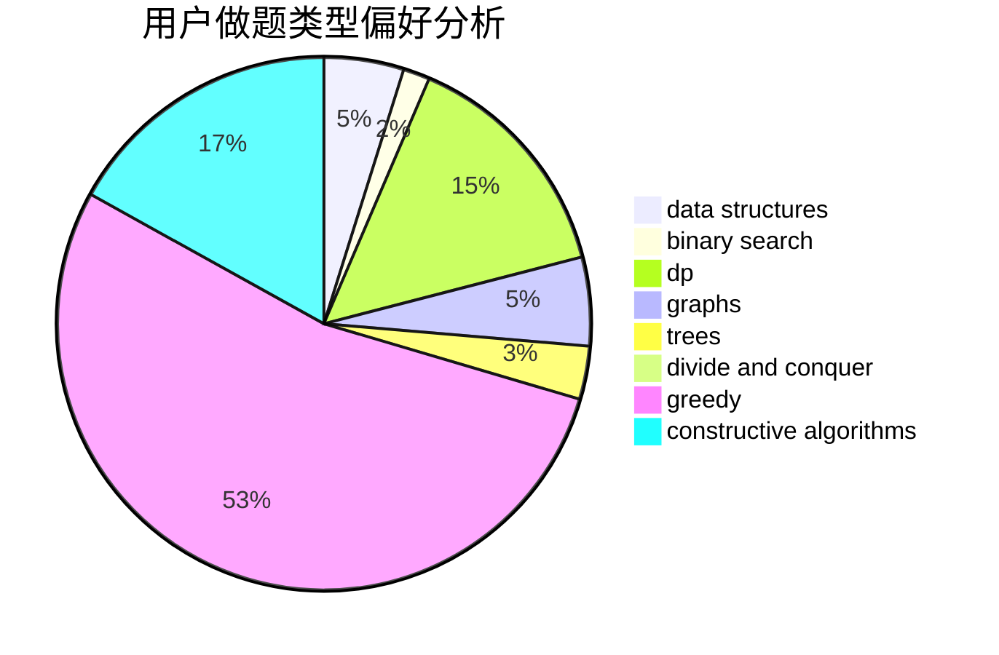
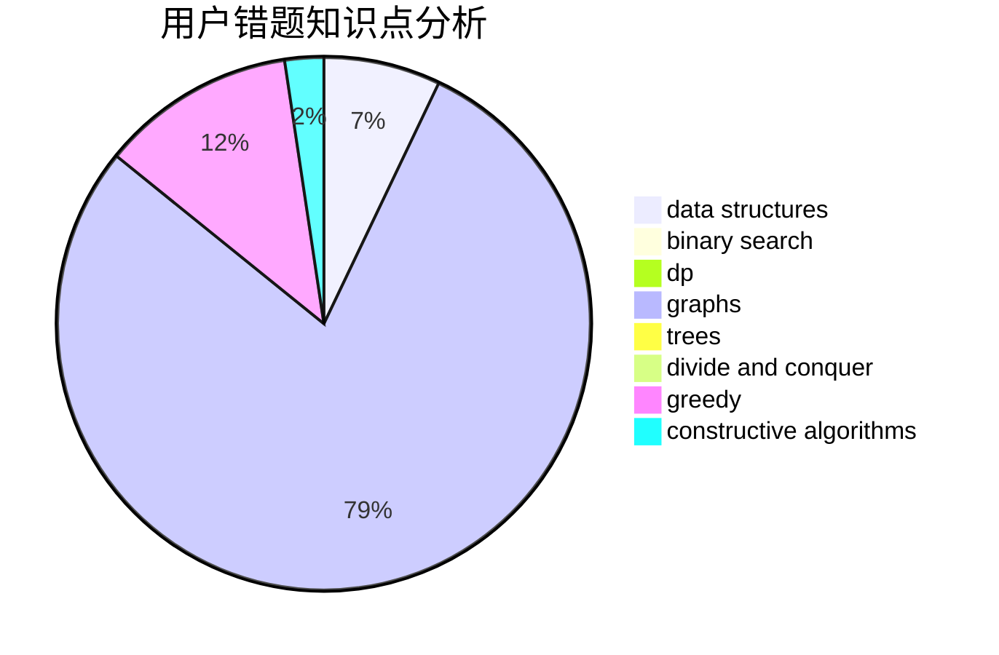

# Chiaro

<!-- tabs:start -->

#### **用户提交结果分析**

#### **用户做题类型偏好分析**

#### **用户错题知识点分析**

<!-- tabs:end -->
# 推荐题目
[16C](https://codeforces.com/contest/16/problem/C)		binary search,
                        number theory		  
[1041C](https://codeforces.com/contest/1041/problem/C)		binary search,
                        data structures,
                        greedy,
                        two pointers		  
[1147E](https://codeforces.com/contest/1147/problem/E)		interactive		  
[484A](https://codeforces.com/contest/484/problem/A)		bitmasks,
                        constructive algorithms		  
[1169C](https://codeforces.com/contest/1169/problem/C)		dsu,graphs,sortings,trees		  
[321D](https://codeforces.com/contest/321/problem/D)		dp,
                        greedy,
                        math		  
[1064B](https://codeforces.com/contest/1064/problem/B)		math		  
[360A](https://codeforces.com/contest/360/problem/A)		greedy,
                        implementation		  
[483D](https://codeforces.com/contest/483/problem/D)		dsu,graphs,sortings,trees		  
[1288B](https://codeforces.com/contest/1288/problem/B)		math		  
