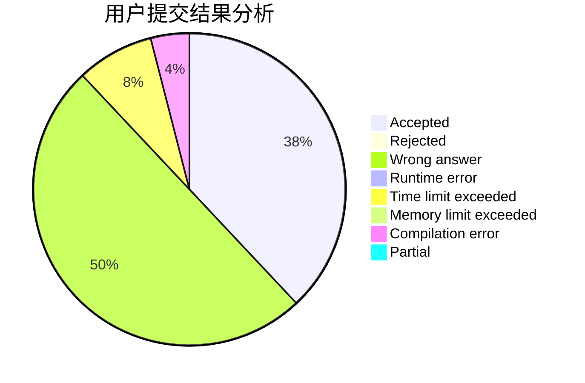
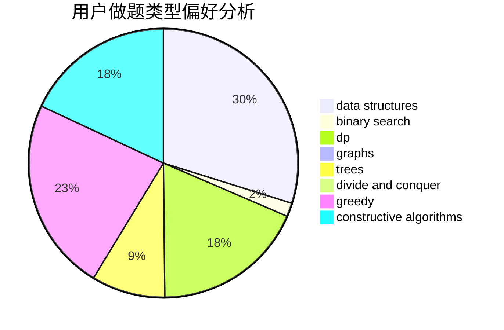
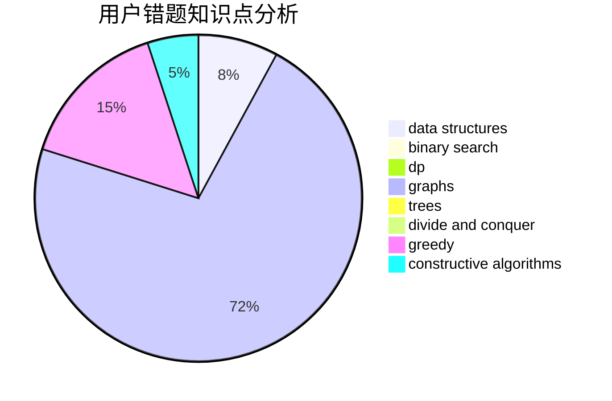

# Chiaro

<!-- tabs:start -->

#### **用户提交结果分析**

#### **用户做题类型偏好分析**

#### **用户错题知识点分析**

<!-- tabs:end -->
# 推荐题目
[1511F](https://codeforces.com/contest/1511/problem/F)		brute force,
                        data structures,
                        dp,
                        matrices,
                        string suffix structures,
                        strings		  
[1040D](https://codeforces.com/contest/1040/problem/D)		dsu,graphs,sortings,trees		  
[1145D](https://codeforces.com/contest/1145/problem/D)		implementation		  
[464B](https://codeforces.com/contest/464/problem/B)		brute force,
                        geometry		  
[1166D](https://codeforces.com/contest/1166/problem/D)		binary search,
                        brute force,
                        greedy,
                        math		  
[303C](https://codeforces.com/contest/303/problem/C)		brute force,
                        graphs,
                        math,
                        number theory		  
[1063E](https://codeforces.com/contest/1063/problem/E)		constructive algorithms,
                        math		  
[333B](https://codeforces.com/contest/333/problem/B)		greedy		  
[463D](https://codeforces.com/contest/463/problem/D)		dfs and similar,
                        dp,
                        graphs,
                        implementation		  
[1281F](https://codeforces.com/contest/1281/problem/F)		dsu,graphs,sortings,trees		  
