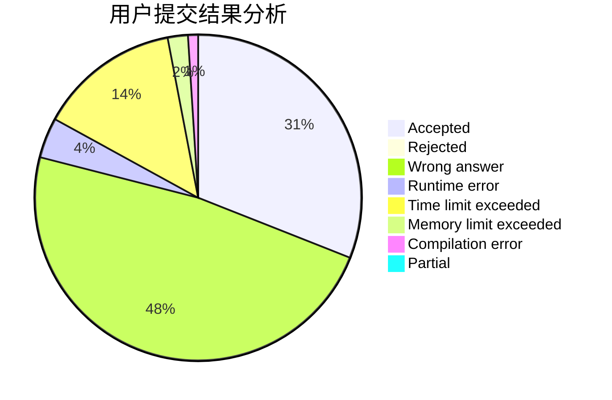
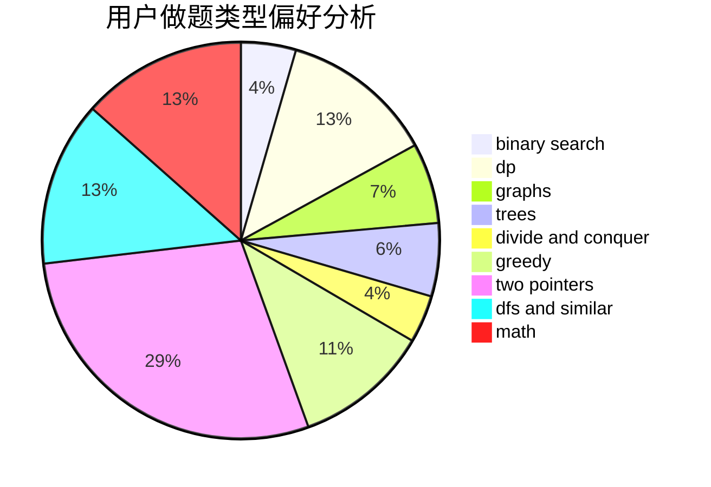

# zzt_

<!-- tabs:start -->

#### **用户提交结果分析**

#### **用户做题类型偏好分析**

<!-- tabs:end -->
# 推荐题目
[831F](https://codeforces.com/contest/831/problem/F)
[1256D](https://codeforces.com/contest/1256/problem/D)
[468E](https://codeforces.com/contest/468/problem/E)
[948C](https://codeforces.com/contest/948/problem/C)
[12162](https://codeforces.com/contest/1216/problem/2)
[990D](https://codeforces.com/contest/990/problem/D)
[766B](https://codeforces.com/contest/766/problem/B)
[682E](https://codeforces.com/contest/682/problem/E)
[741B](https://codeforces.com/contest/741/problem/B)
[1342D](https://codeforces.com/contest/1342/problem/D)
