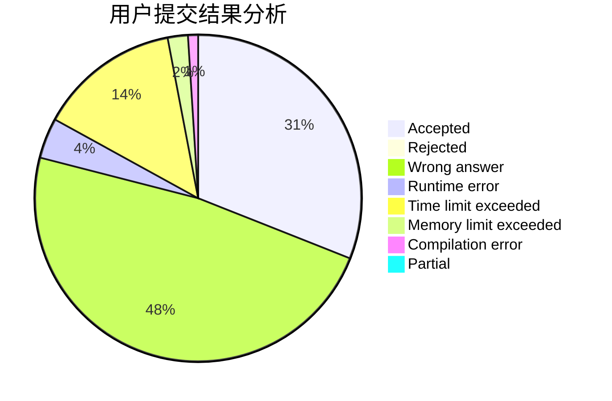
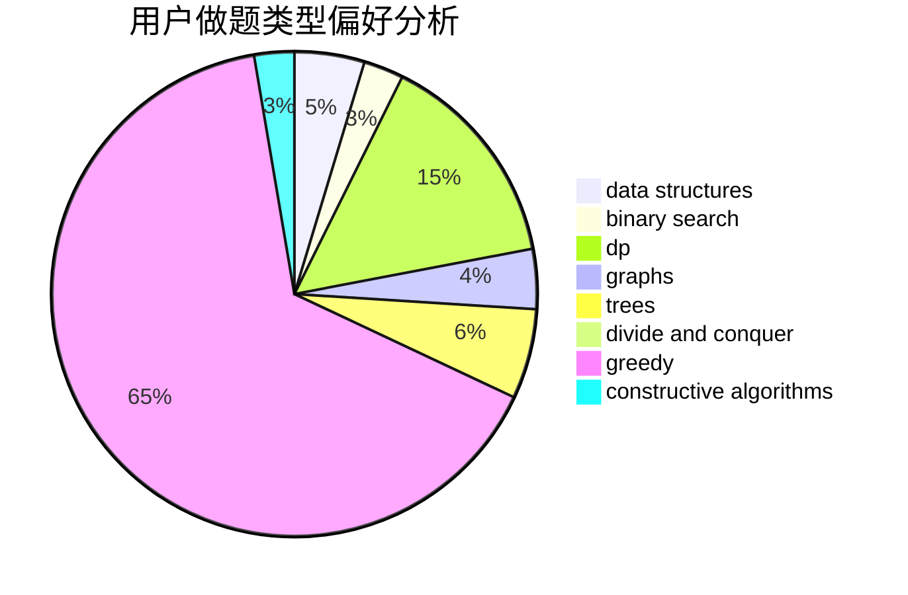

# zzt_

<!-- tabs:start -->


#### **用户提交结果分析**


```mermaid
pie title 用户提交结果分析
    "Accepted" :  31
    "Rejected" :  0
    "Wrong answer" :  48
    "Runtime error" :  4
    "Time limit exceeded" :  14
    "Memory limit exceeded" :  2
    "Compilation error" :  1
    "Partial" :  0
```

#### **用户做题类型偏好分析**


```mermaid
pie title 用户做题类型偏好分析
    "data structures" :  7
    "binary search" :  4
    "dp" :  22
    "graphs" :  6
    "trees" :  9
    "divide and conquer" :  0
    "greedy" :  98
    "constructive algorithms" :  4
```
#### **用户错题知识点分析**

```mermaid
pie title 用户错题知识点分析
