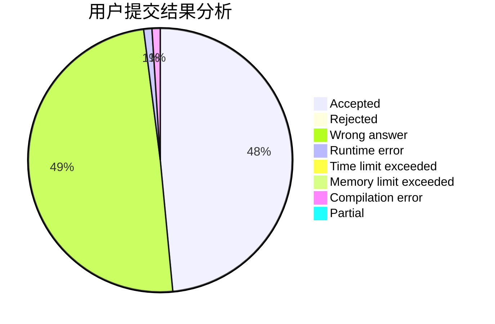
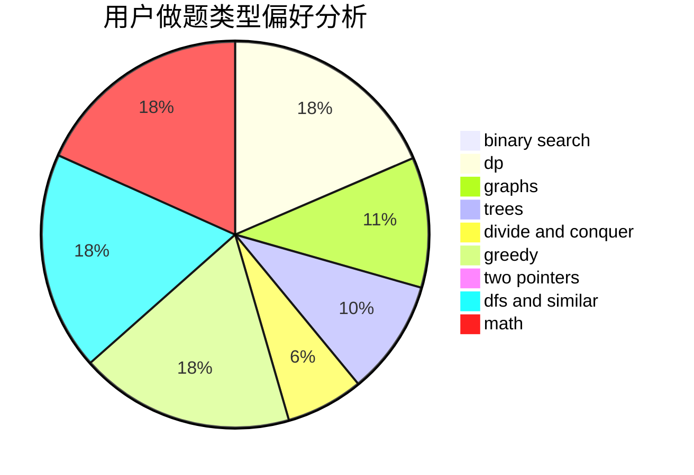

# zzugzx

<!-- tabs:start -->

#### **用户提交结果分析**

#### **用户做题类型偏好分析**

<!-- tabs:end -->
# 推荐题目
[11841](https://codeforces.com/contest/1184/problem/1)
[1407E](https://codeforces.com/contest/1407/problem/E)
[1380F](https://codeforces.com/contest/1380/problem/F)
[877C](https://codeforces.com/contest/877/problem/C)
[1246C](https://codeforces.com/contest/1246/problem/C)
[1046C](https://codeforces.com/contest/1046/problem/C)
[739A](https://codeforces.com/contest/739/problem/A)
[1070L](https://codeforces.com/contest/1070/problem/L)
[372B](https://codeforces.com/contest/372/problem/B)
[365A](https://codeforces.com/contest/365/problem/A)
