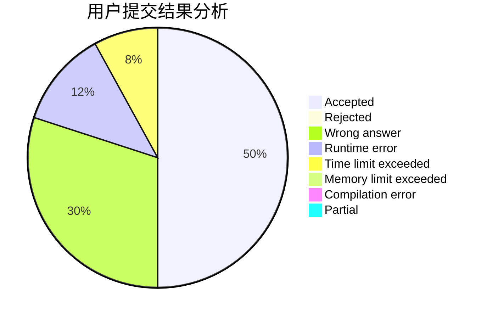
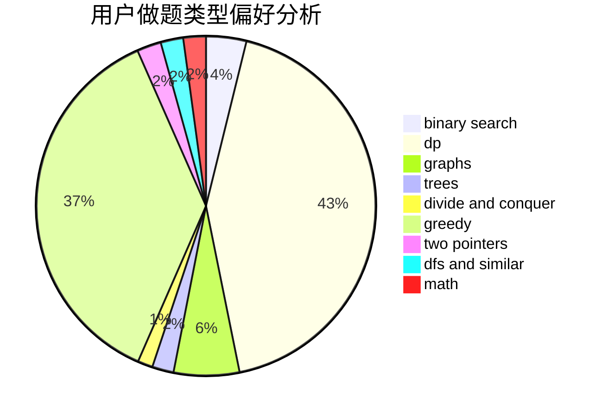

# zzuli-hanjk

<!-- tabs:start -->

#### **用户提交结果分析**

#### **用户做题类型偏好分析**

<!-- tabs:end -->
# 推荐题目
[1343D](https://codeforces.com/contest/1343/problem/D)
[759B](https://codeforces.com/contest/759/problem/B)
[603A](https://codeforces.com/contest/603/problem/A)
[819D](https://codeforces.com/contest/819/problem/D)
[1030A](https://codeforces.com/contest/1030/problem/A)
[1345E](https://codeforces.com/contest/1345/problem/E)
[1101F](https://codeforces.com/contest/1101/problem/F)
[791B](https://codeforces.com/contest/791/problem/B)
[1164K](https://codeforces.com/contest/1164/problem/K)
[764C](https://codeforces.com/contest/764/problem/C)
