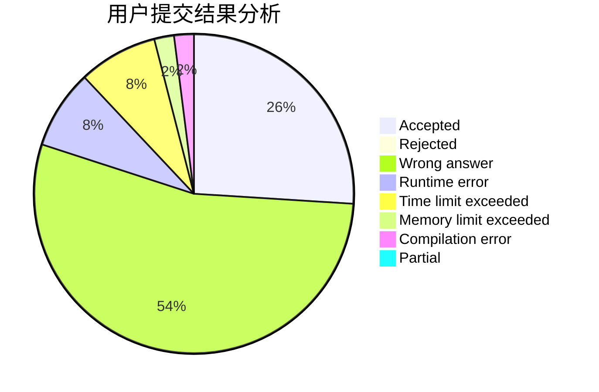
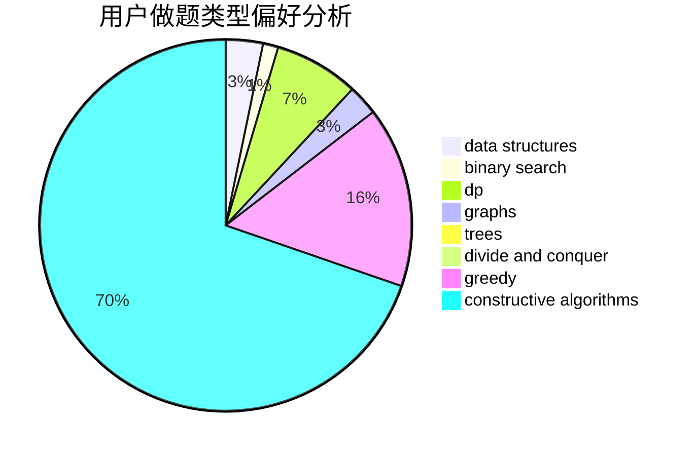
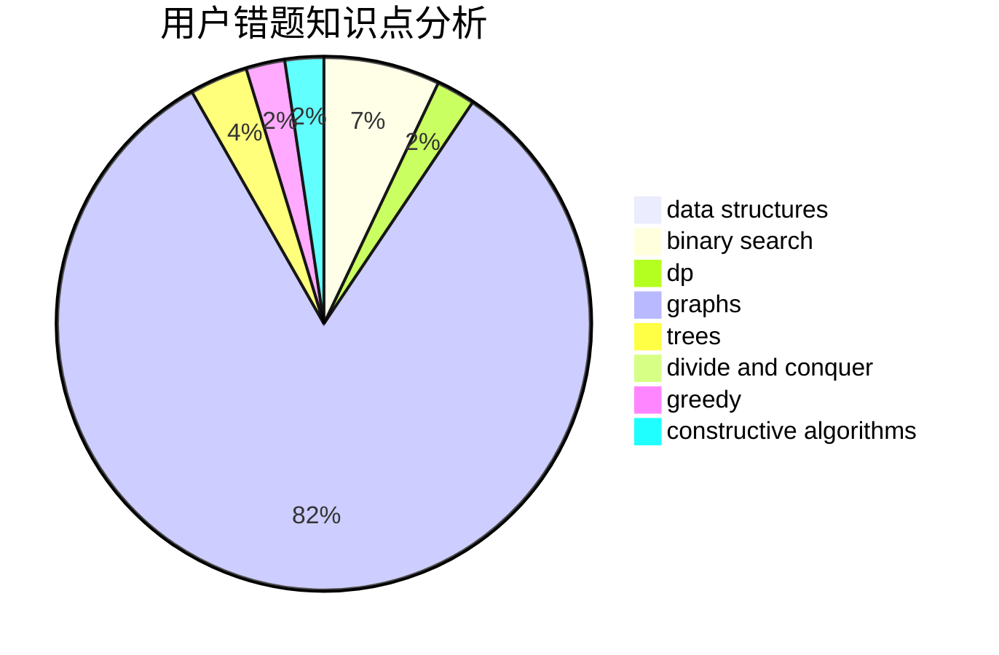

# Chinese_Pikaync_

<!-- tabs:start -->

#### **用户提交结果分析**

#### **用户做题类型偏好分析**

#### **用户错题知识点分析**

<!-- tabs:end -->
# 推荐题目
[1471C](https://codeforces.com/contest/1471/problem/C)		dsu,graphs,sortings,trees		  
[1472A](https://codeforces.com/contest/1472/problem/A)		greedy,
                        math		  
[1365F](https://codeforces.com/contest/1365/problem/F)		constructive algorithms,
                        implementation,
                        sortings		  
[1504C](https://codeforces.com/contest/1504/problem/C)		dsu,graphs,sortings,trees		  
[371C](https://codeforces.com/contest/371/problem/C)		binary search,
                        brute force		  
[710D](https://codeforces.com/contest/710/problem/D)		math,
                        number theory		  
[494B](https://codeforces.com/contest/494/problem/B)		dp,
                        strings		  
[425E](https://codeforces.com/contest/425/problem/E)		dp		  
[710B](https://codeforces.com/contest/710/problem/B)		brute force,
                        sortings		  
[710E](https://codeforces.com/contest/710/problem/E)		dfs and similar,
                        dp		  
