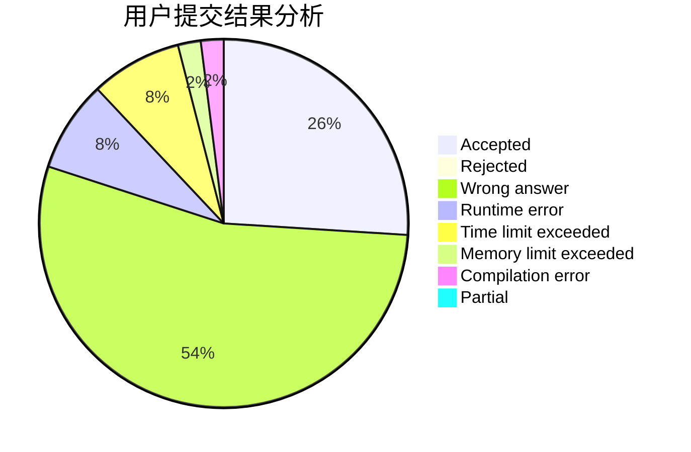
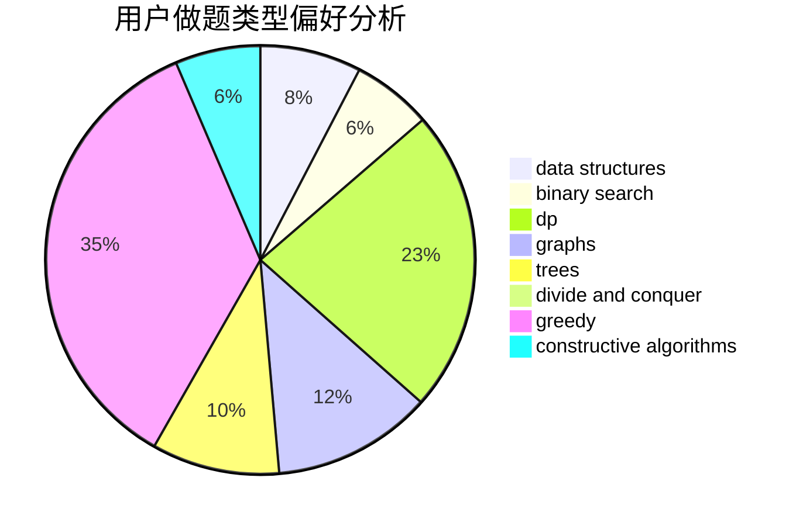
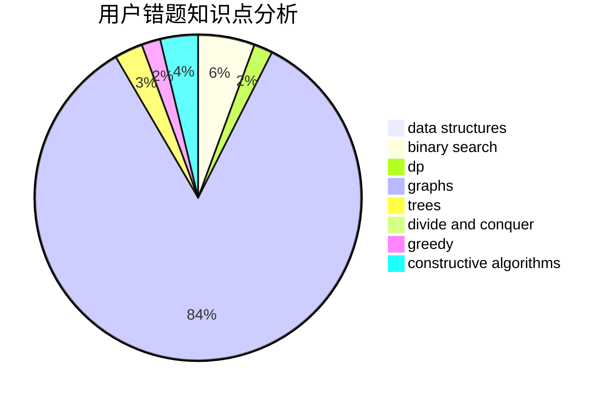

# Chinese_Pikaync_

<!-- tabs:start -->

#### **用户提交结果分析**

#### **用户做题类型偏好分析**

#### **用户错题知识点分析**

<!-- tabs:end -->
# 推荐题目
[1464B](https://codeforces.com/contest/1464/problem/B)		dsu,graphs,sortings,trees		  
[1464F](https://codeforces.com/contest/1464/problem/F)		data structures,
                        trees		  
[1357D4](https://codeforces.com/contest/1357D/problem/4)		nan		  
[1495C](https://codeforces.com/contest/1495/problem/C)		constructive algorithms,
                        graphs		  
[345A](https://codeforces.com/contest/345/problem/A)		*special problem,
                        probabilities		  
[690D1](https://codeforces.com/contest/690D/problem/1)		nan		  
[475B](https://codeforces.com/contest/475/problem/B)		brute force,
                        dfs and similar,
                        graphs,
                        implementation		  
[39C](https://codeforces.com/contest/39/problem/C)		dp,
                        sortings		  
[690A1](https://codeforces.com/contest/690A/problem/1)		nan		  
[691A](https://codeforces.com/contest/691/problem/A)		implementation		  
