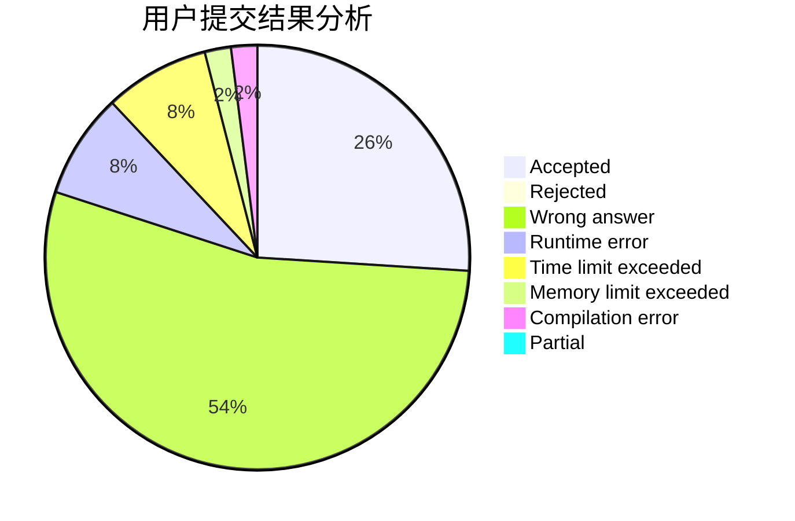
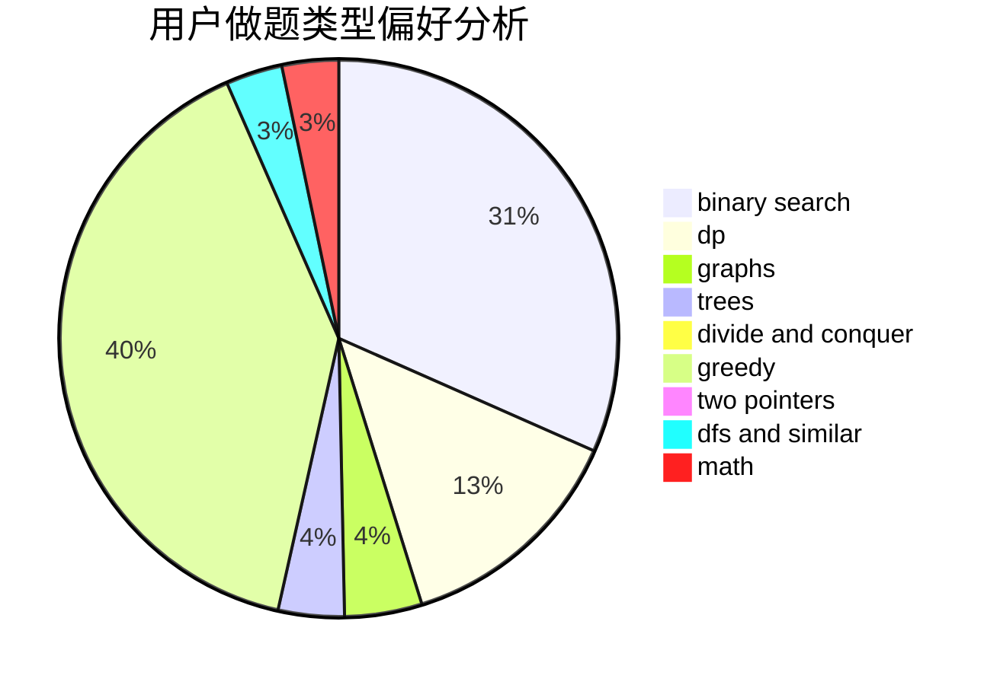

# Chinese_Pikaync_

<!-- tabs:start -->

#### **用户提交结果分析**

#### **用户做题类型偏好分析**

<!-- tabs:end -->
# 推荐题目
[1471C](https://codeforces.com/contest/1471/problem/C)
[1472A](https://codeforces.com/contest/1472/problem/A)
[1365F](https://codeforces.com/contest/1365/problem/F)
[1504C](https://codeforces.com/contest/1504/problem/C)
[371C](https://codeforces.com/contest/371/problem/C)
[710D](https://codeforces.com/contest/710/problem/D)
[494B](https://codeforces.com/contest/494/problem/B)
[425E](https://codeforces.com/contest/425/problem/E)
[710B](https://codeforces.com/contest/710/problem/B)
[710E](https://codeforces.com/contest/710/problem/E)
