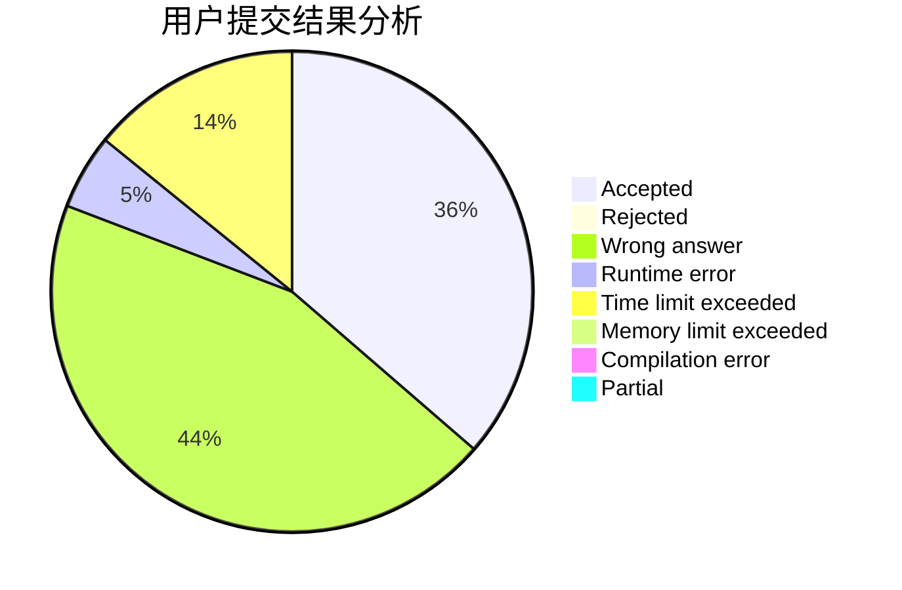
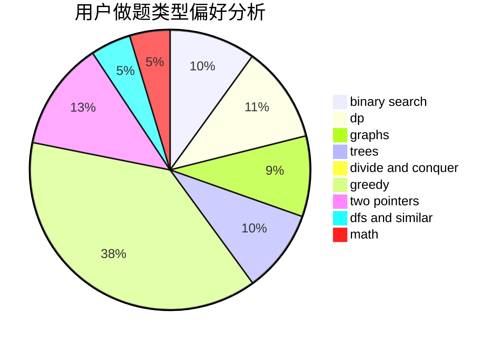

# Chinese_zjc_

<!-- tabs:start -->

#### **用户提交结果分析**

#### **用户做题类型偏好分析**

<!-- tabs:end -->
# 推荐题目
[1166F](https://codeforces.com/contest/1166/problem/F)
[311A](https://codeforces.com/contest/311/problem/A)
[497D](https://codeforces.com/contest/497/problem/D)
[1432F](https://codeforces.com/contest/1432/problem/F)
[1004B](https://codeforces.com/contest/1004/problem/B)
[689A](https://codeforces.com/contest/689/problem/A)
[1402B](https://codeforces.com/contest/1402/problem/B)
[710F](https://codeforces.com/contest/710/problem/F)
[13B](https://codeforces.com/contest/13/problem/B)
[1340E](https://codeforces.com/contest/1340/problem/E)
