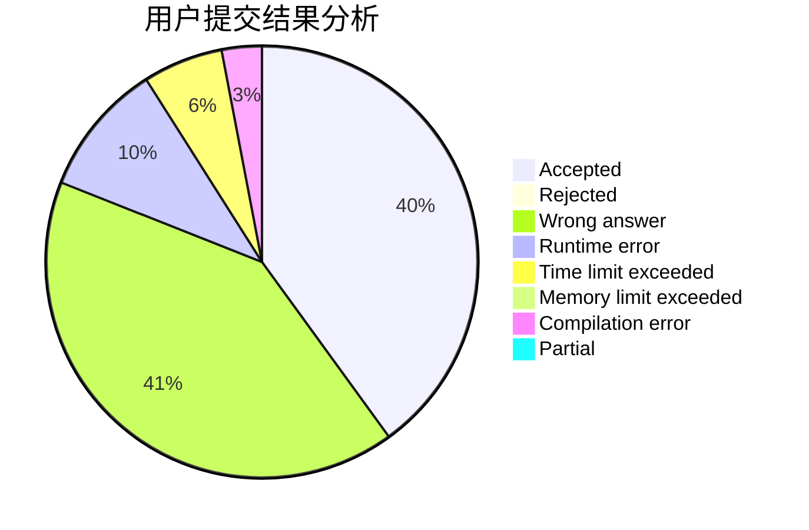
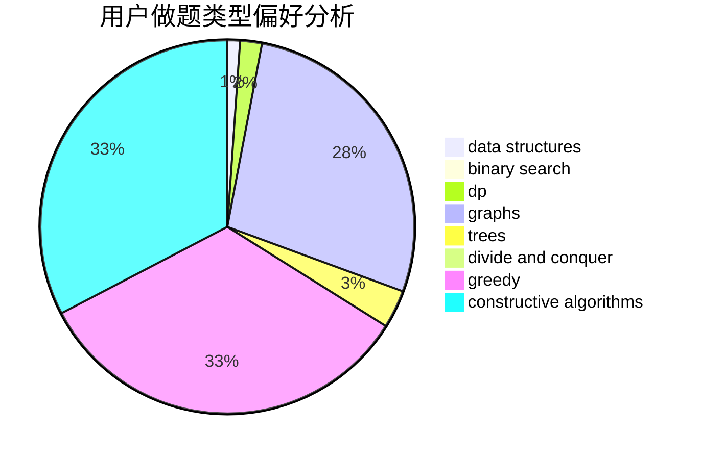

# 1838641320

<!-- tabs:start -->

#### **用户提交结果分析**

#### **用户做题类型偏好分析**

#### **用户错题知识点分析**

<!-- tabs:end -->
# 推荐题目
[11881](https://codeforces.com/contest/1188/problem/1)		dsu,graphs,sortings,trees		  
[11882](https://codeforces.com/contest/1188/problem/2)		dsu,graphs,sortings,trees		  
[1187E](https://codeforces.com/contest/1187/problem/E)		dfs and similar,
                        dp,
                        trees		  
[1185D](https://codeforces.com/contest/1185/problem/D)		implementation,
                        math		  
[11852](https://codeforces.com/contest/1185/problem/2)		dsu,graphs,sortings,trees		  
[1180D](https://codeforces.com/contest/1180/problem/D)		dsu,graphs,sortings,trees		  
[1188E](https://codeforces.com/contest/1188/problem/E)		combinatorics		  
[1186D](https://codeforces.com/contest/1186/problem/D)		constructive algorithms,
                        greedy,
                        math		  
[1188C](https://codeforces.com/contest/1188/problem/C)		dp		  
[1113A](https://codeforces.com/contest/1113/problem/A)		dp,
                        greedy,
                        math		  
