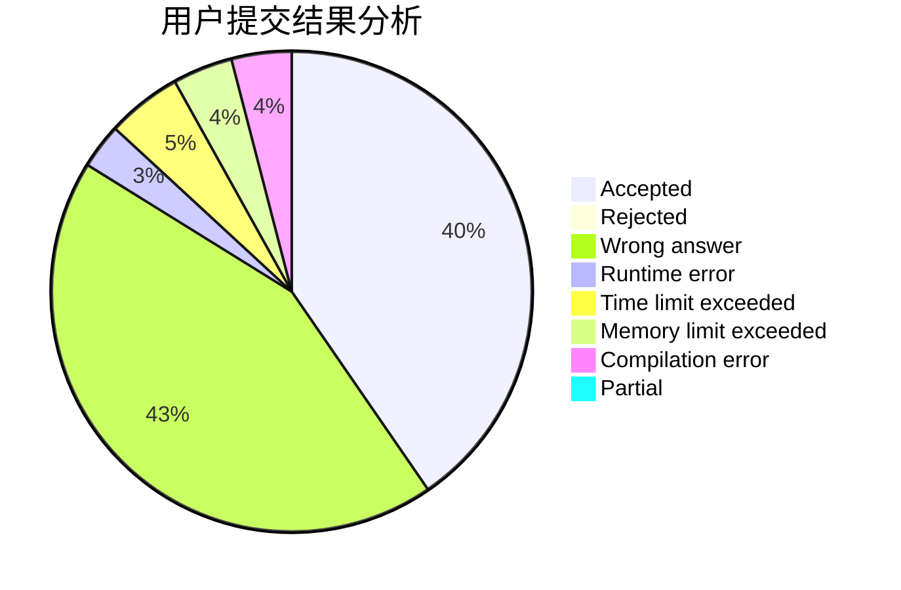
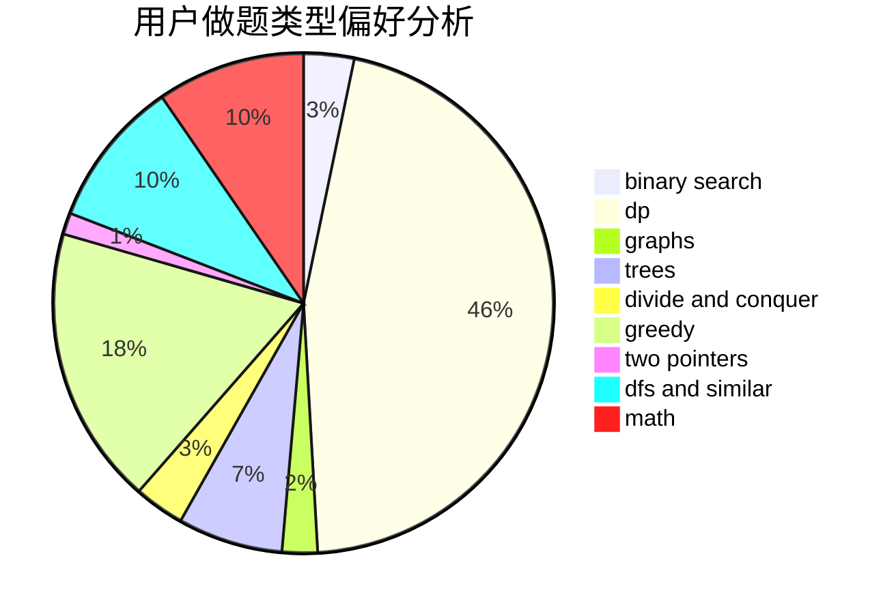

# Chiro_11

<!-- tabs:start -->

#### **用户提交结果分析**

#### **用户做题类型偏好分析**

<!-- tabs:end -->
# 推荐题目
[653C](https://codeforces.com/contest/653/problem/C)
[388B](https://codeforces.com/contest/388/problem/B)
[1384A](https://codeforces.com/contest/1384/problem/A)
[220C](https://codeforces.com/contest/220/problem/C)
[714B](https://codeforces.com/contest/714/problem/B)
[1442D](https://codeforces.com/contest/1442/problem/D)
[1283C](https://codeforces.com/contest/1283/problem/C)
[713A](https://codeforces.com/contest/713/problem/A)
[712C](https://codeforces.com/contest/712/problem/C)
[713E](https://codeforces.com/contest/713/problem/E)
