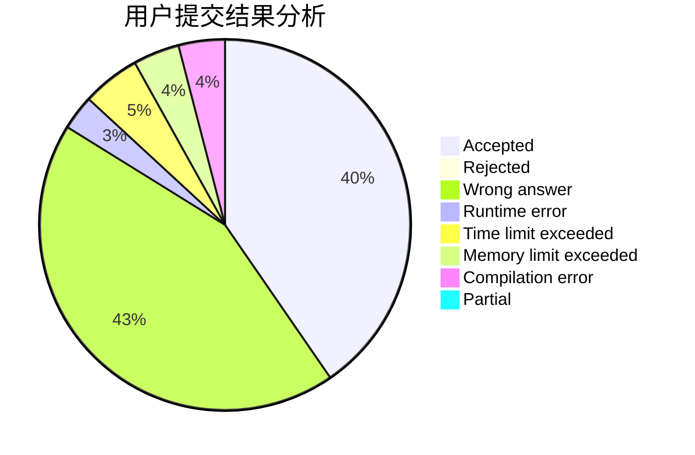
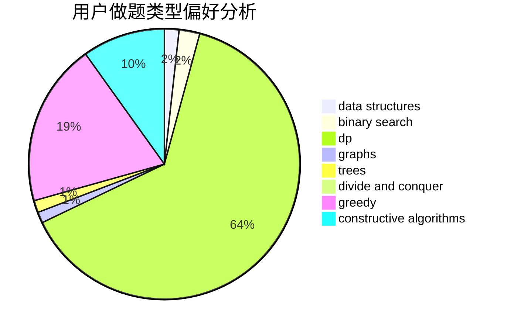
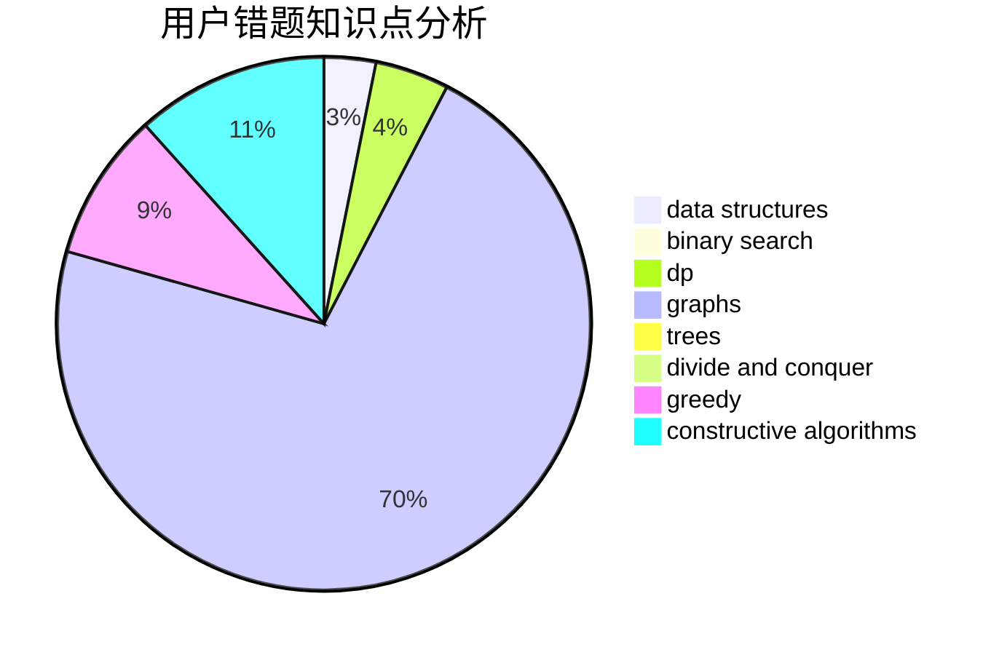

# Chiro_11

<!-- tabs:start -->

#### **用户提交结果分析**

#### **用户做题类型偏好分析**

#### **用户错题知识点分析**

<!-- tabs:end -->
# 推荐题目
[653C](https://codeforces.com/contest/653/problem/C)		brute force,
                        implementation		  
[388B](https://codeforces.com/contest/388/problem/B)		bitmasks,
                        constructive algorithms,
                        graphs,
                        implementation,
                        math		  
[1384A](https://codeforces.com/contest/1384/problem/A)		constructive algorithms,
                        greedy,
                        strings		  
[220C](https://codeforces.com/contest/220/problem/C)		data structures		  
[714B](https://codeforces.com/contest/714/problem/B)		implementation,
                        sortings		  
[1442D](https://codeforces.com/contest/1442/problem/D)		data structures,
                        divide and conquer,
                        dp,
                        greedy		  
[1283C](https://codeforces.com/contest/1283/problem/C)		constructive algorithms,
                        data structures,
                        math		  
[713A](https://codeforces.com/contest/713/problem/A)		data structures,
                        implementation		  
[712C](https://codeforces.com/contest/712/problem/C)		greedy,
                        math		  
[713E](https://codeforces.com/contest/713/problem/E)		binary search,
                        dp		  
