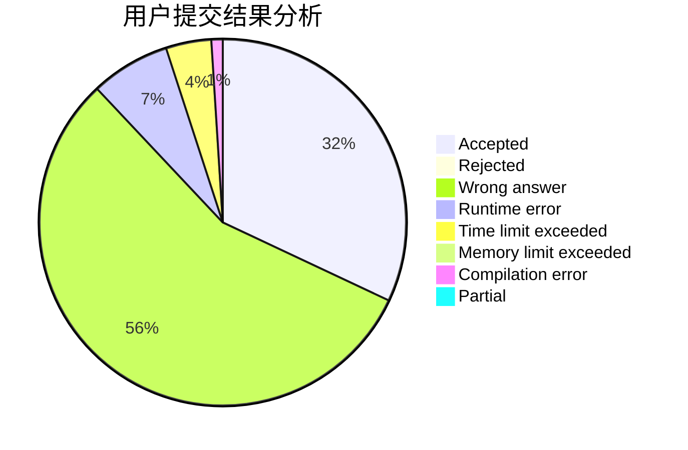
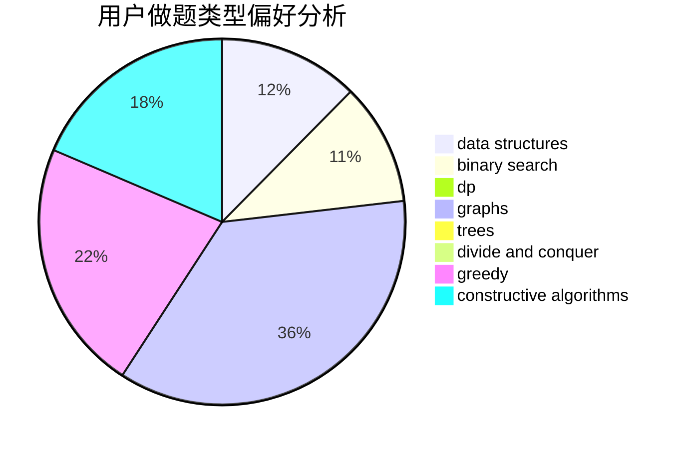
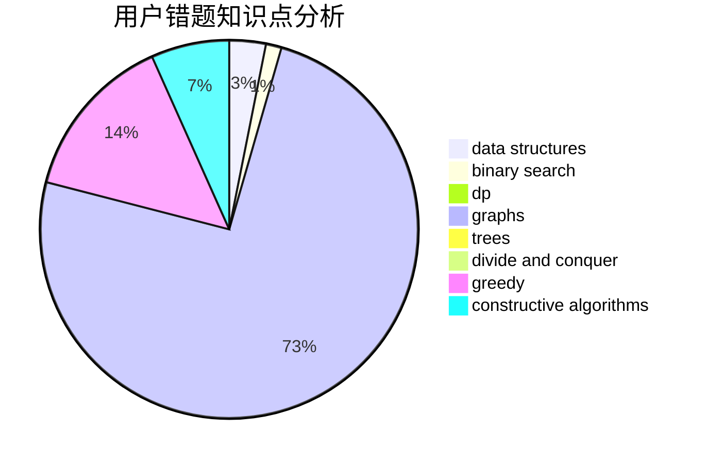

# Chirography_11

<!-- tabs:start -->

#### **用户提交结果分析**

#### **用户做题类型偏好分析**

#### **用户错题知识点分析**

<!-- tabs:end -->
# 推荐题目
[28D](https://codeforces.com/contest/28/problem/D)		binary search,
                        data structures,
                        dp,
                        hashing		  
[653C](https://codeforces.com/contest/653/problem/C)		brute force,
                        implementation		  
[266D](https://codeforces.com/contest/266/problem/D)		graphs,
                        math,
                        shortest paths		  
[699B](https://codeforces.com/contest/699/problem/B)		implementation		  
[698C](https://codeforces.com/contest/698/problem/C)		bitmasks,
                        dp,
                        math,
                        probabilities		  
[699C](https://codeforces.com/contest/699/problem/C)		dsu,graphs,sortings,trees		  
[1141E](https://codeforces.com/contest/1141/problem/E)		math		  
[369A](https://codeforces.com/contest/369/problem/A)		greedy,
                        implementation		  
[1506B](https://codeforces.com/contest/1506/problem/B)		greedy,
                        implementation		  
[698B](https://codeforces.com/contest/698/problem/B)		constructive algorithms,
                        dfs and similar,
                        dsu,
                        graphs,
                        trees		  
