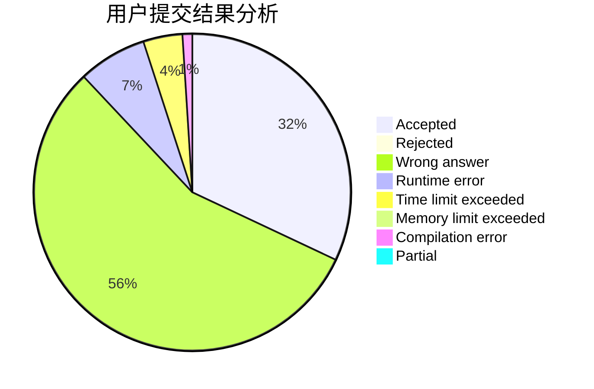
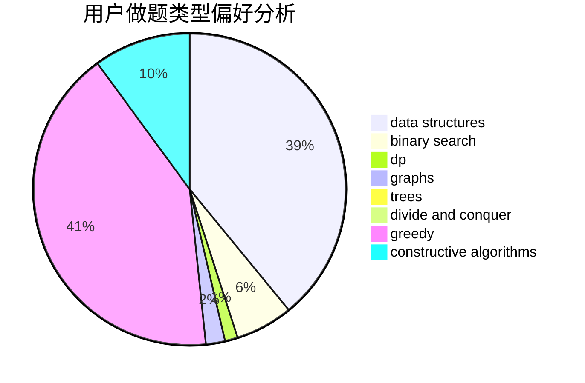
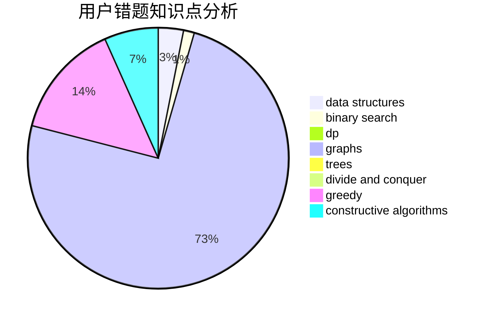

# Chirography_11

<!-- tabs:start -->

#### **用户提交结果分析**

#### **用户做题类型偏好分析**

#### **用户错题知识点分析**

<!-- tabs:end -->
# 推荐题目
[304D](https://codeforces.com/contest/304/problem/D)		dsu,graphs,sortings,trees		  
[677C](https://codeforces.com/contest/677/problem/C)		bitmasks,
                        combinatorics,
                        implementation,
                        strings		  
[282C](https://codeforces.com/contest/282/problem/C)		constructive algorithms,
                        implementation,
                        math		  
[716A](https://codeforces.com/contest/716/problem/A)		implementation		  
[715A](https://codeforces.com/contest/715/problem/A)		constructive algorithms,
                        math		  
[716B](https://codeforces.com/contest/716/problem/B)		greedy,
                        two pointers		  
[1143E](https://codeforces.com/contest/1143/problem/E)		dsu,graphs,sortings,trees		  
[39C](https://codeforces.com/contest/39/problem/C)		dp,
                        sortings		  
[157C](https://codeforces.com/contest/157/problem/C)		dsu,graphs,sortings,trees		  
[714E](https://codeforces.com/contest/714/problem/E)		dsu,graphs,sortings,trees		  
