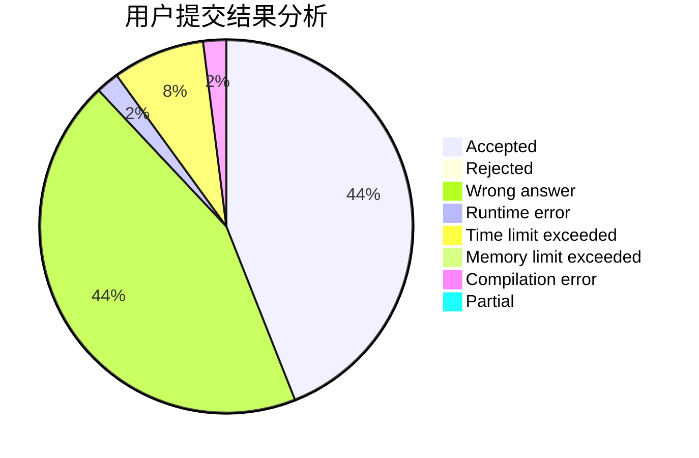
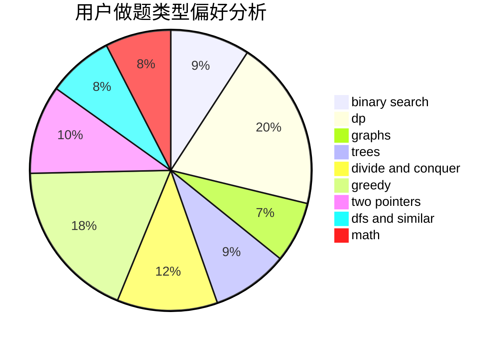

# Chitanda_

<!-- tabs:start -->

#### **用户提交结果分析**

#### **用户做题类型偏好分析**

<!-- tabs:end -->
# 推荐题目
[1425B](https://codeforces.com/contest/1425/problem/B)
[506A](https://codeforces.com/contest/506/problem/A)
[549B](https://codeforces.com/contest/549/problem/B)
[717E](https://codeforces.com/contest/717/problem/E)
[122C](https://codeforces.com/contest/122/problem/C)
[1248E](https://codeforces.com/contest/1248/problem/E)
[1199C](https://codeforces.com/contest/1199/problem/C)
[641E](https://codeforces.com/contest/641/problem/E)
[671C](https://codeforces.com/contest/671/problem/C)
[497B](https://codeforces.com/contest/497/problem/B)
