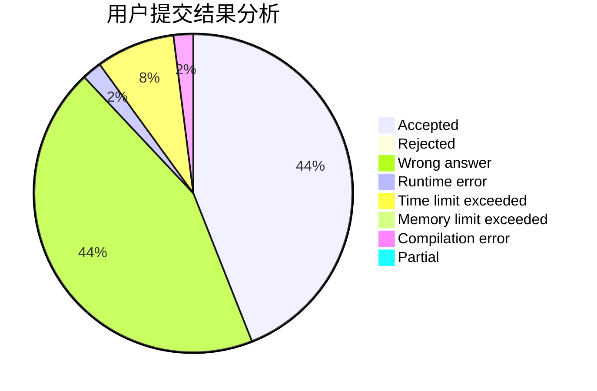
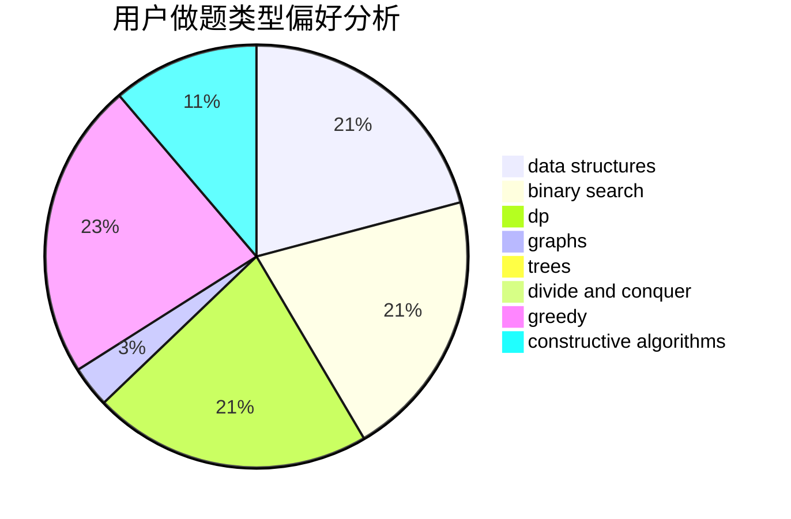
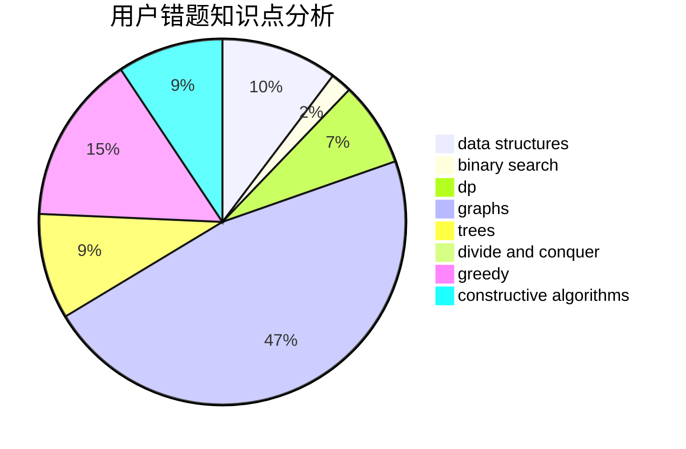

# Chitanda_

<!-- tabs:start -->

#### **用户提交结果分析**

#### **用户做题类型偏好分析**

#### **用户错题知识点分析**

<!-- tabs:end -->
# 推荐题目
[1417E](https://codeforces.com/contest/1417/problem/E)		dsu,graphs,sortings,trees		  
[484E](https://codeforces.com/contest/484/problem/E)		binary search,
                        constructive algorithms,
                        data structures		  
[524E](https://codeforces.com/contest/524/problem/E)		data structures,
                        sortings		  
[6C](https://codeforces.com/contest/6/problem/C)		greedy,
                        two pointers		  
[1221G](https://codeforces.com/contest/1221/problem/G)		bitmasks,
                        brute force,
                        combinatorics,
                        dp,
                        meet-in-the-middle		  
[1243D](https://codeforces.com/contest/1243/problem/D)		dsu,graphs,sortings,trees		  
[1195A](https://codeforces.com/contest/1195/problem/A)		greedy,
                        math		  
[61B](https://codeforces.com/contest/61/problem/B)		strings		  
[644A](https://codeforces.com/contest/644/problem/A)		*special problem,
                        constructive algorithms		  
[477B](https://codeforces.com/contest/477/problem/B)		dsu,graphs,sortings,trees		  
