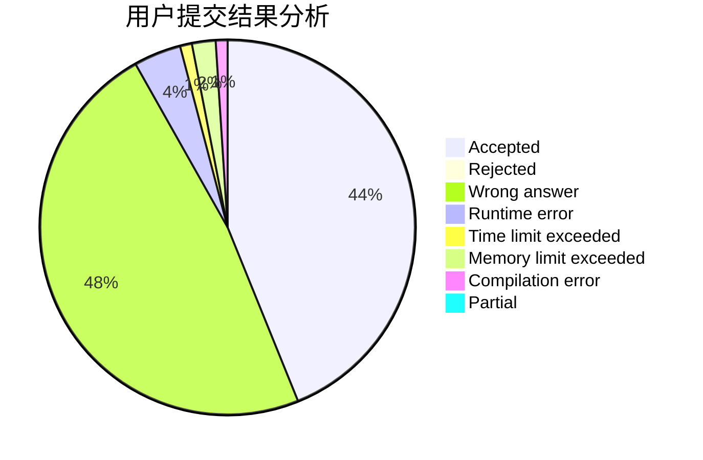
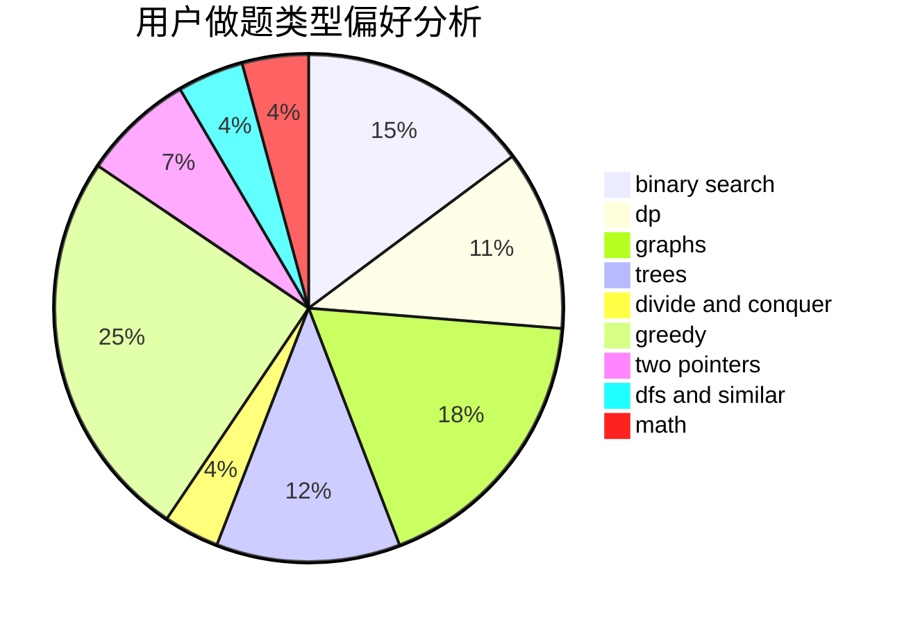

# Chloecc

<!-- tabs:start -->

#### **用户提交结果分析**

#### **用户做题类型偏好分析**

<!-- tabs:end -->
# 推荐题目
[1016B](https://codeforces.com/contest/1016/problem/B)
[1432F](https://codeforces.com/contest/1432/problem/F)
[58E](https://codeforces.com/contest/58/problem/E)
[17C](https://codeforces.com/contest/17/problem/C)
[509C](https://codeforces.com/contest/509/problem/C)
[379D](https://codeforces.com/contest/379/problem/D)
[671C](https://codeforces.com/contest/671/problem/C)
[717I](https://codeforces.com/contest/717/problem/I)
[504A](https://codeforces.com/contest/504/problem/A)
[142D](https://codeforces.com/contest/142/problem/D)
