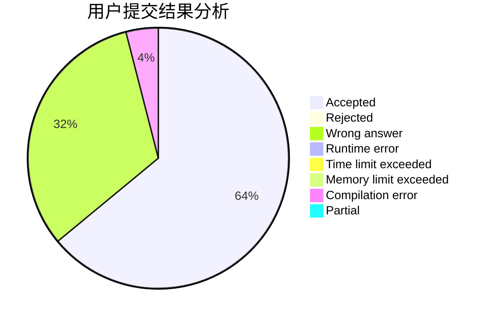
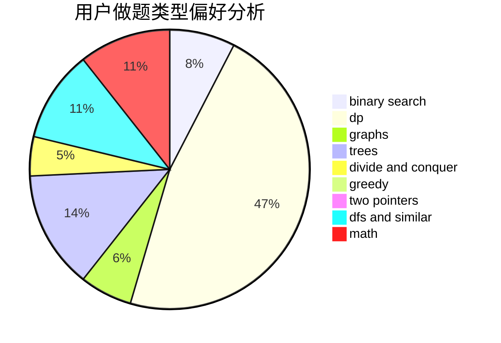

# ChrisRamirez

<!-- tabs:start -->

#### **用户提交结果分析**

#### **用户做题类型偏好分析**

<!-- tabs:end -->
# 推荐题目
[1316F](https://codeforces.com/contest/1316/problem/F)
[507D](https://codeforces.com/contest/507/problem/D)
[327D](https://codeforces.com/contest/327/problem/D)
[1496F](https://codeforces.com/contest/1496/problem/F)
[1043F](https://codeforces.com/contest/1043/problem/F)
[1432D](https://codeforces.com/contest/1432/problem/D)
[171B](https://codeforces.com/contest/171/problem/B)
[472D](https://codeforces.com/contest/472/problem/D)
[1314A](https://codeforces.com/contest/1314/problem/A)
[1099B](https://codeforces.com/contest/1099/problem/B)
