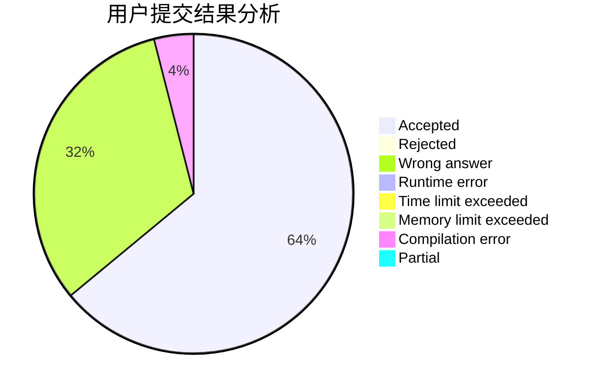
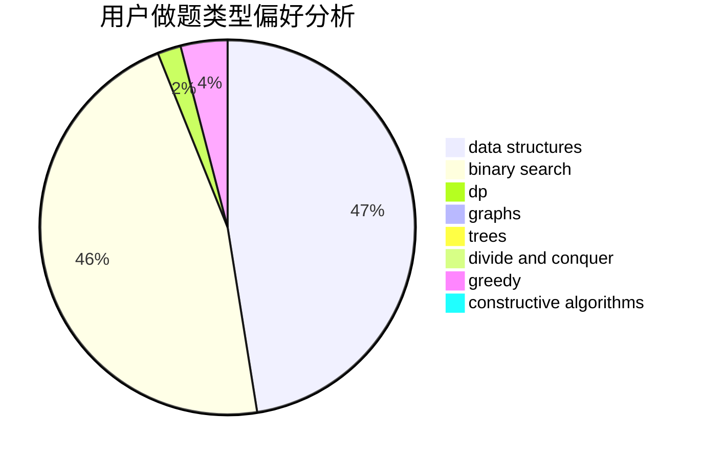

# ChrisRamirez

<!-- tabs:start -->

#### **用户提交结果分析**

#### **用户做题类型偏好分析**

#### **用户错题知识点分析**

<!-- tabs:end -->
# 推荐题目
[1310C](https://codeforces.com/contest/1310/problem/C)		binary search,
                        dp,
                        strings		  
[486D](https://codeforces.com/contest/486/problem/D)		dfs and similar,
                        dp,
                        math,
                        trees		  
[306B](https://codeforces.com/contest/306/problem/B)		data structures,
                        greedy,
                        sortings		  
[1488H](https://codeforces.com/contest/1488/problem/H)		*special problem,
                        combinatorics,
                        data structures		  
[1043C](https://codeforces.com/contest/1043/problem/C)		constructive algorithms,
                        greedy,
                        implementation		  
[1423N](https://codeforces.com/contest/1423/problem/N)		nan		  
[1512B](https://codeforces.com/contest/1512/problem/B)		implementation		  
[451A](https://codeforces.com/contest/451/problem/A)		implementation		  
[1305B](https://codeforces.com/contest/1305/problem/B)		constructive algorithms,
                        greedy,
                        strings,
                        two pointers		  
[1098E](https://codeforces.com/contest/1098/problem/E)		binary search,
                        implementation,
                        math,
                        number theory		  
