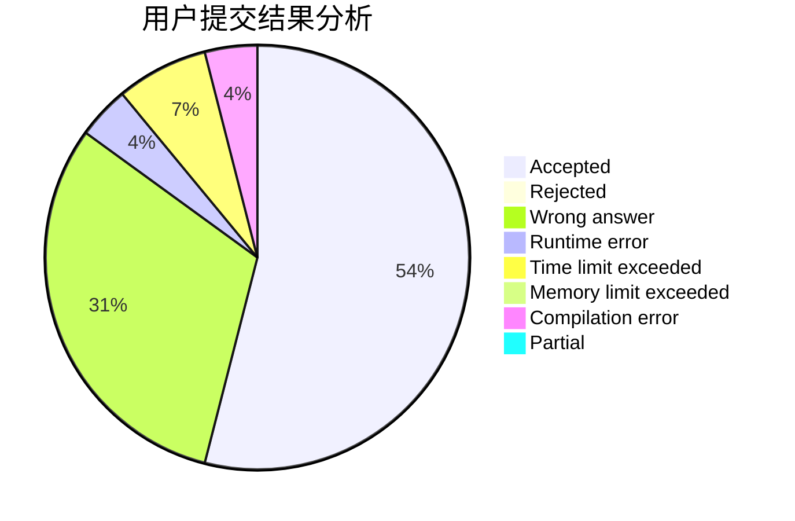
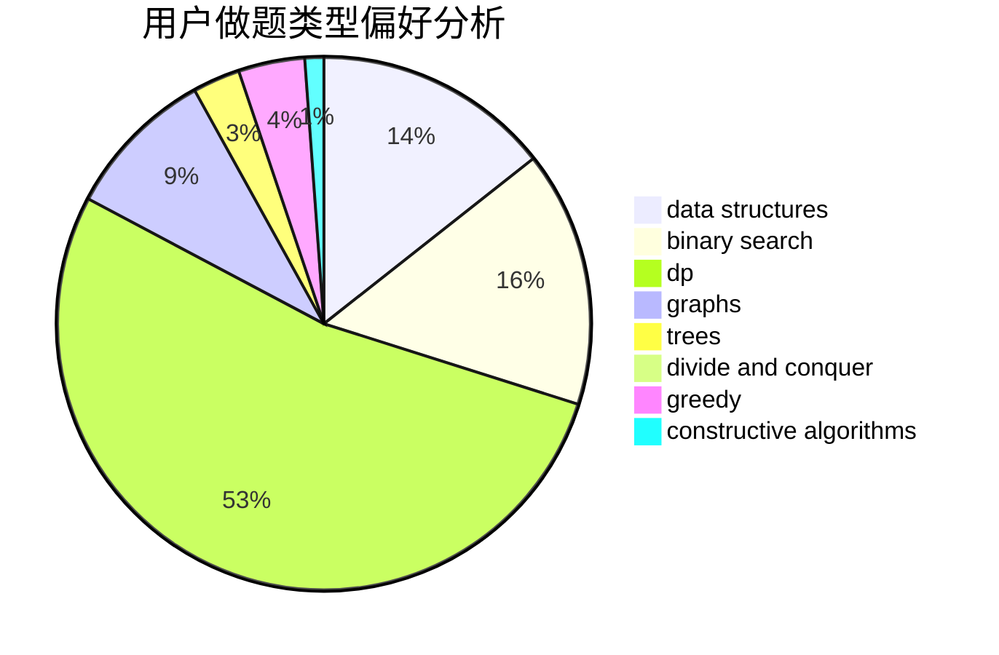
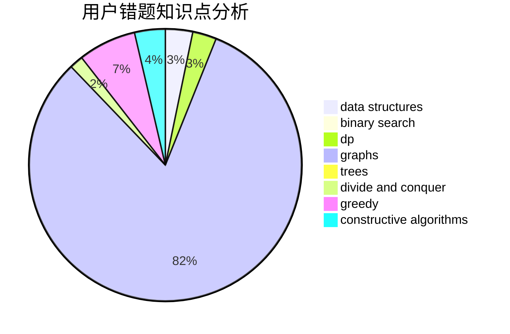

# Chromefish

<!-- tabs:start -->

#### **用户提交结果分析**

#### **用户做题类型偏好分析**

#### **用户错题知识点分析**

<!-- tabs:end -->
# 推荐题目
[720D](https://codeforces.com/contest/720/problem/D)		data structures,
                        dp,
                        sortings		  
[329B](https://codeforces.com/contest/329/problem/B)		dfs and similar,
                        shortest paths		  
[720C](https://codeforces.com/contest/720/problem/C)		constructive algorithms		  
[581A](https://codeforces.com/contest/581/problem/A)		implementation,
                        math		  
[1090B](https://codeforces.com/contest/1090/problem/B)		nan		  
[713A](https://codeforces.com/contest/713/problem/A)		data structures,
                        implementation		  
[611B](https://codeforces.com/contest/611/problem/B)		bitmasks,
                        brute force,
                        implementation		  
[341C](https://codeforces.com/contest/341/problem/C)		dsu,graphs,sortings,trees		  
[71B](https://codeforces.com/contest/71/problem/B)		implementation,
                        math		  
[136D](https://codeforces.com/contest/136/problem/D)		dsu,graphs,sortings,trees		  
