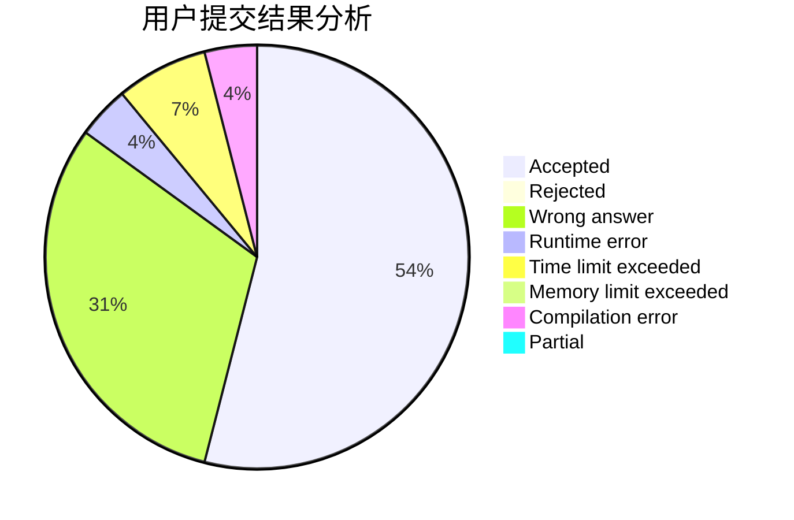
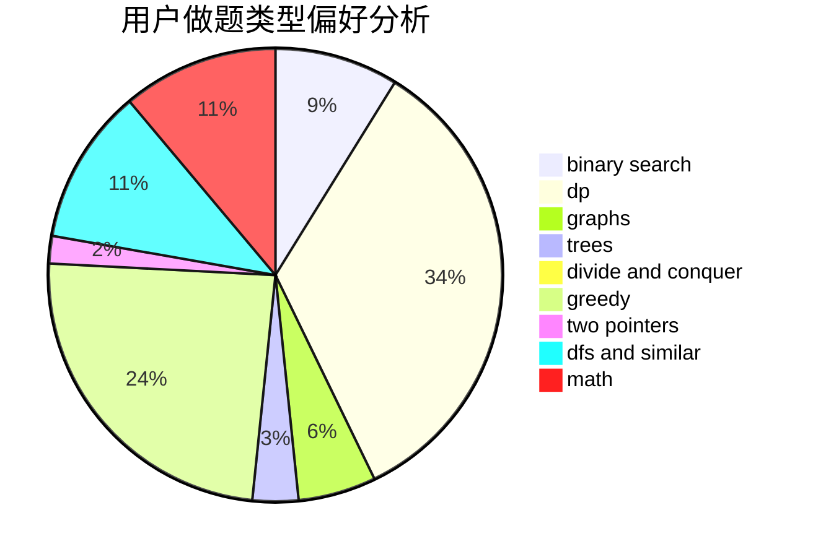

# Chromefish

<!-- tabs:start -->

#### **用户提交结果分析**

#### **用户做题类型偏好分析**

<!-- tabs:end -->
# 推荐题目
[720D](https://codeforces.com/contest/720/problem/D)
[329B](https://codeforces.com/contest/329/problem/B)
[720C](https://codeforces.com/contest/720/problem/C)
[581A](https://codeforces.com/contest/581/problem/A)
[1090B](https://codeforces.com/contest/1090/problem/B)
[713A](https://codeforces.com/contest/713/problem/A)
[611B](https://codeforces.com/contest/611/problem/B)
[341C](https://codeforces.com/contest/341/problem/C)
[71B](https://codeforces.com/contest/71/problem/B)
[136D](https://codeforces.com/contest/136/problem/D)
