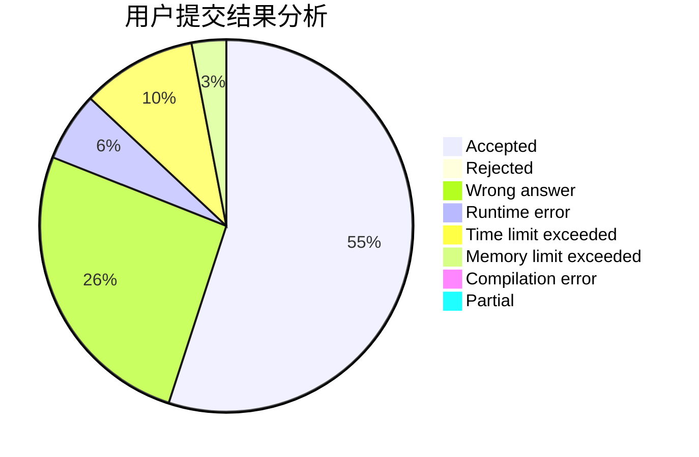
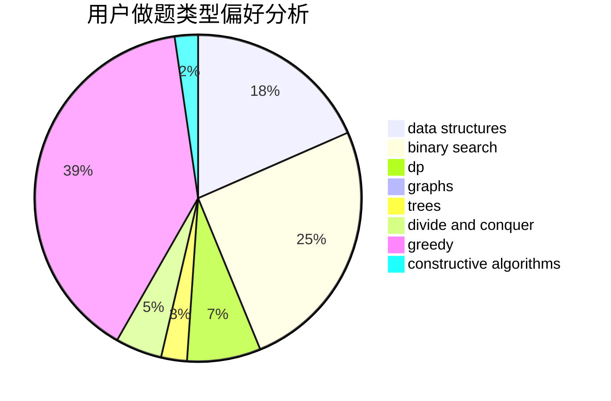

# ChthollyNotaSeniorious

<!-- tabs:start -->

#### **用户提交结果分析**

#### **用户做题类型偏好分析**

#### **用户错题知识点分析**

<!-- tabs:end -->
# 推荐题目
[451A](https://codeforces.com/contest/451/problem/A)		implementation		  
[1119G](https://codeforces.com/contest/1119/problem/G)		constructive algorithms,
                        implementation		  
[53E](https://codeforces.com/contest/53/problem/E)		bitmasks,
                        dp		  
[1346E](https://codeforces.com/contest/1346/problem/E)		*special problem,
                        dp,
                        graphs		  
[3C](https://codeforces.com/contest/3/problem/C)		brute force,
                        games,
                        implementation		  
[721A](https://codeforces.com/contest/721/problem/A)		implementation		  
[1100C](https://codeforces.com/contest/1100/problem/C)		binary search,
                        geometry,
                        math		  
[665F](https://codeforces.com/contest/665/problem/F)		data structures,
                        dp,
                        math,
                        number theory,
                        sortings,
                        two pointers		  
[5131](https://codeforces.com/contest/513/problem/1)		dsu,graphs,sortings,trees		  
[200B](https://codeforces.com/contest/200/problem/B)		implementation,
                        math		  
