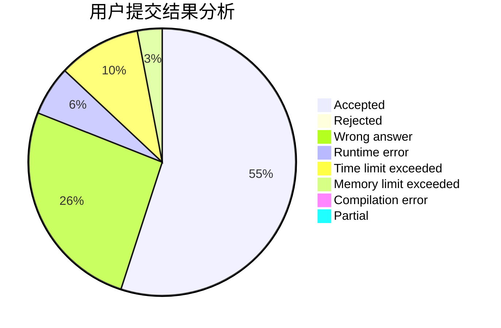
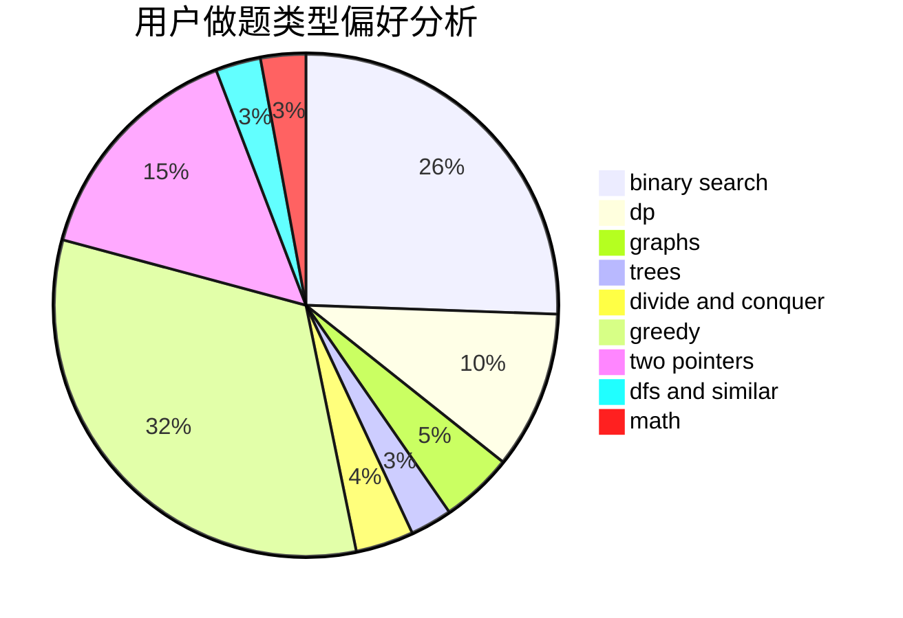

# ChthollyNotaSeniorious

<!-- tabs:start -->

#### **用户提交结果分析**

#### **用户做题类型偏好分析**

<!-- tabs:end -->
# 推荐题目
[451A](https://codeforces.com/contest/451/problem/A)
[1119G](https://codeforces.com/contest/1119/problem/G)
[53E](https://codeforces.com/contest/53/problem/E)
[1346E](https://codeforces.com/contest/1346/problem/E)
[3C](https://codeforces.com/contest/3/problem/C)
[721A](https://codeforces.com/contest/721/problem/A)
[1100C](https://codeforces.com/contest/1100/problem/C)
[665F](https://codeforces.com/contest/665/problem/F)
[5131](https://codeforces.com/contest/513/problem/1)
[200B](https://codeforces.com/contest/200/problem/B)
