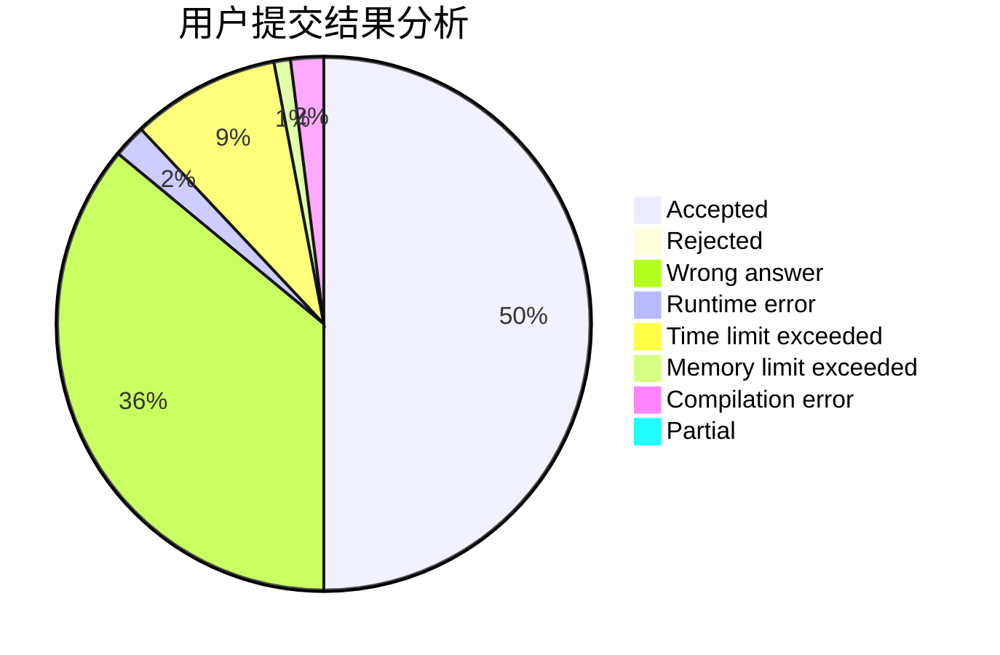
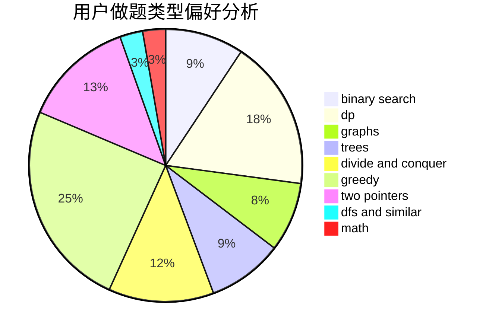

# ChuTian

<!-- tabs:start -->

#### **用户提交结果分析**

#### **用户做题类型偏好分析**

<!-- tabs:end -->
# 推荐题目
[548A](https://codeforces.com/contest/548/problem/A)
[722D](https://codeforces.com/contest/722/problem/D)
[1424M](https://codeforces.com/contest/1424/problem/M)
[234A](https://codeforces.com/contest/234/problem/A)
[567A](https://codeforces.com/contest/567/problem/A)
[1154D](https://codeforces.com/contest/1154/problem/D)
[723D](https://codeforces.com/contest/723/problem/D)
[722C](https://codeforces.com/contest/722/problem/C)
[38C](https://codeforces.com/contest/38/problem/C)
[1360B](https://codeforces.com/contest/1360/problem/B)
