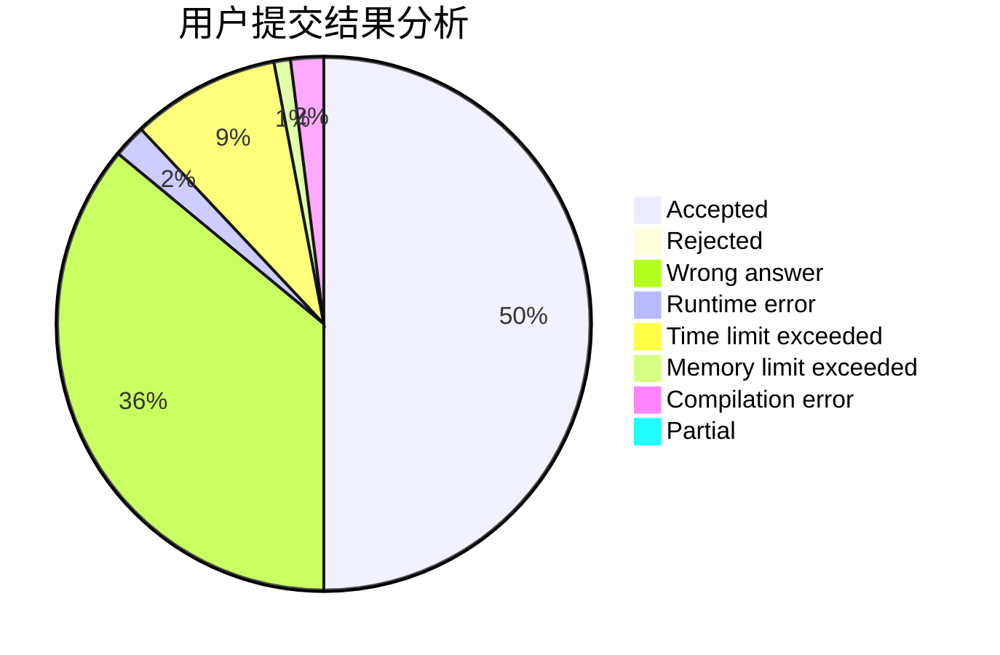
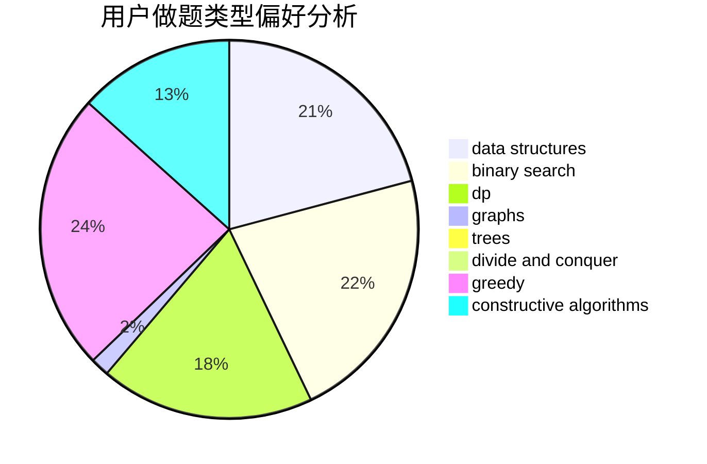
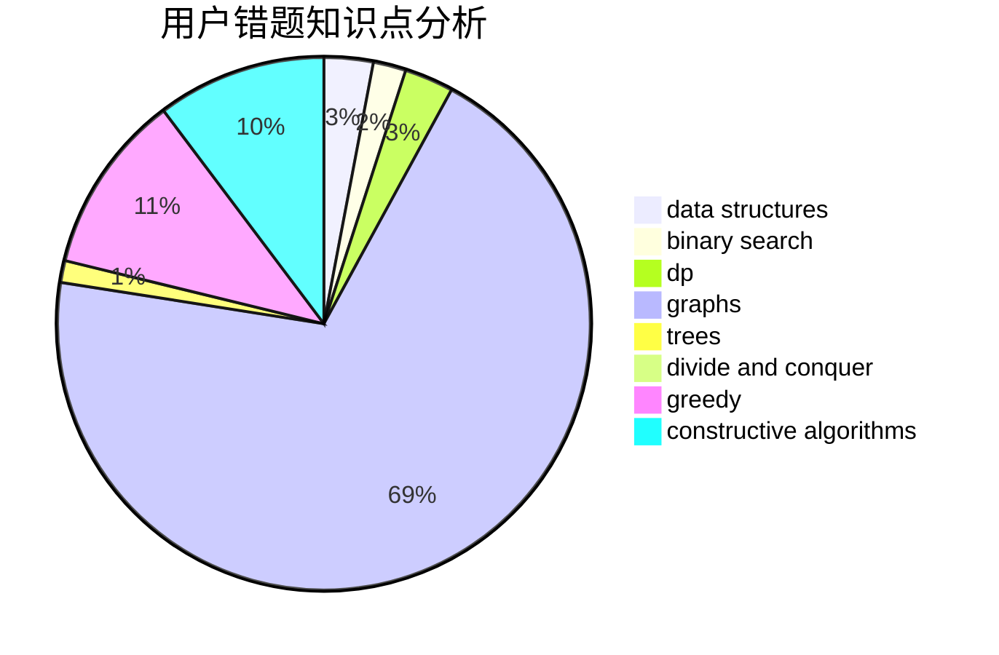

# ChuTian

<!-- tabs:start -->

#### **用户提交结果分析**

#### **用户做题类型偏好分析**

#### **用户错题知识点分析**

<!-- tabs:end -->
# 推荐题目
[522D](https://codeforces.com/contest/522/problem/D)		*special problem,
                        data structures		  
[703C](https://codeforces.com/contest/703/problem/C)		geometry,
                        implementation		  
[1417C](https://codeforces.com/contest/1417/problem/C)		dsu,graphs,sortings,trees		  
[215B](https://codeforces.com/contest/215/problem/B)		greedy,
                        math		  
[542E](https://codeforces.com/contest/542/problem/E)		graphs,
                        shortest paths		  
[1152D](https://codeforces.com/contest/1152/problem/D)		dp,
                        greedy,
                        trees		  
[704D](https://codeforces.com/contest/704/problem/D)		flows,
                        greedy		  
[703B](https://codeforces.com/contest/703/problem/B)		implementation,
                        math		  
[363D](https://codeforces.com/contest/363/problem/D)		binary search,
                        greedy		  
[1353D](https://codeforces.com/contest/1353/problem/D)		constructive algorithms,
                        data structures,
                        sortings		  
