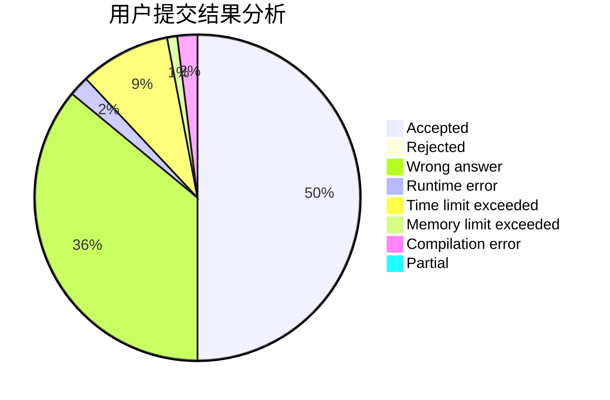
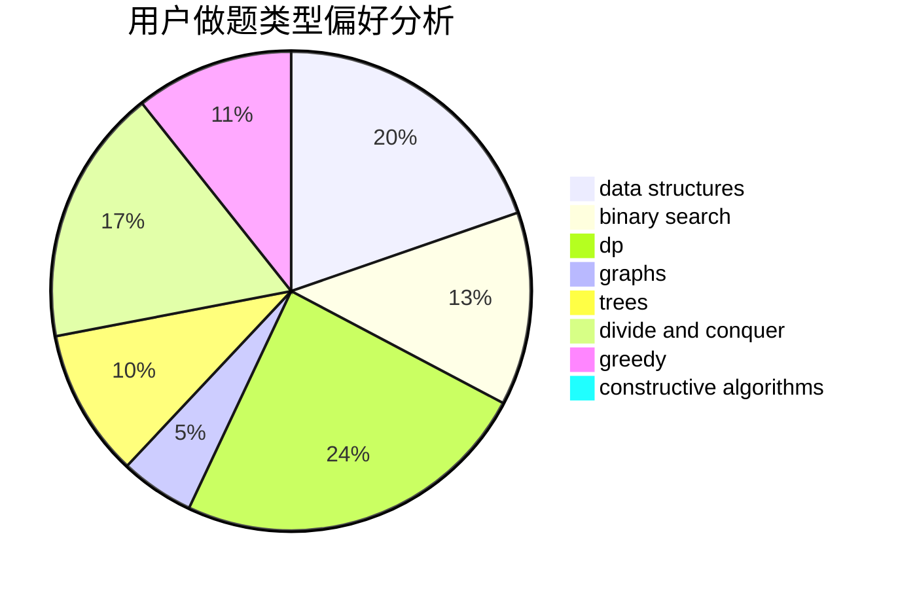
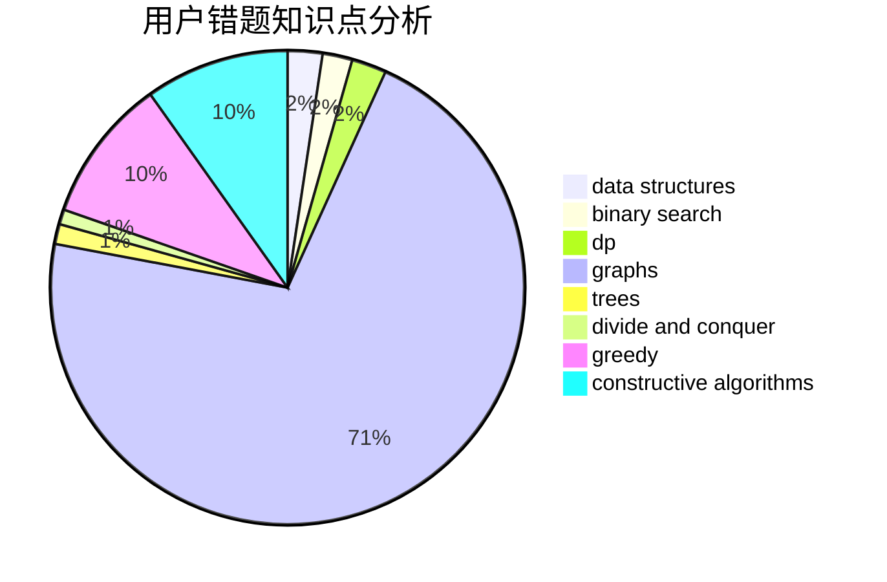

# ChuTian

<!-- tabs:start -->

#### **用户提交结果分析**

#### **用户做题类型偏好分析**

#### **用户错题知识点分析**

<!-- tabs:end -->
# 推荐题目
[548A](https://codeforces.com/contest/548/problem/A)		brute force,
                        implementation,
                        strings		  
[722D](https://codeforces.com/contest/722/problem/D)		binary search,
                        data structures,
                        dfs and similar,
                        greedy,
                        strings,
                        trees		  
[1424M](https://codeforces.com/contest/1424/problem/M)		graphs,
                        sortings		  
[234A](https://codeforces.com/contest/234/problem/A)		implementation		  
[567A](https://codeforces.com/contest/567/problem/A)		greedy,
                        implementation		  
[1154D](https://codeforces.com/contest/1154/problem/D)		greedy		  
[723D](https://codeforces.com/contest/723/problem/D)		dfs and similar,
                        dsu,
                        graphs,
                        greedy,
                        implementation		  
[722C](https://codeforces.com/contest/722/problem/C)		data structures,
                        dsu		  
[38C](https://codeforces.com/contest/38/problem/C)		brute force		  
[1360B](https://codeforces.com/contest/1360/problem/B)		greedy,
                        sortings		  
